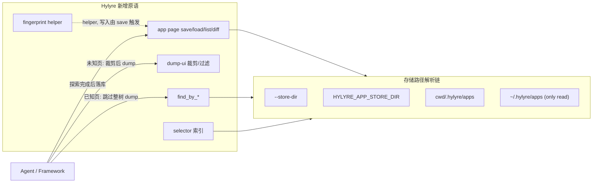

# App Knowledge Persistence Layer

## 设计原则

- Hylyre 仍是「快速、准确的设备操作 SDK」，新增能力都是**原语**与**schema 约定**，不替调用方决策。
- 所有新工具同步暴露 **CLI** 与 **MCP**（强 CLI / 弱 MCP 薄壳，与 [docs/agent-loop.md](docs/agent-loop.md) 现有原则一致）。
- 解决用户实测的痛点：`com.huawei.hmos.wallet` 主页 215KB JSON → 期望默认 ≤10KB；同 app 跨用例查表免重新 dump。

## 数据流



## Schema 约定（v1，由 Hylyre 拥有；framework 共享）

`<store>/<bundle>/pages/<page-name>.json`：

```json
{
  "schema_version": "hylyre-app-page-v1",
  "bundle": "com.huawei.hmos.wallet",
  "ability_name": "MainAbility",
  "page_name": "home",
  "app_version": "string|null",
  "fingerprint": "sha256|null",
  "fingerprint_inputs": ["..."],
  "captured_at": "ISO-8601",
  "tree": { /* dump-ui payload (含 _hylyre_hints) */ },
  "key_elements": [
    {"id": "...", "key": "...", "text": "...", "type": "...", "bounds": "...",
     "clickable": "true|false", "scrollable": "true|false"}
  ],
  "actions": []
}
```

`<store>/<bundle>/index.json`（save 时自动维护）：

```json
{
  "schema_version": "hylyre-app-index-v1",
  "bundle": "...",
  "elements": {
    "<synthetic_key>": {
      "selector": {"by_id": "..."},
      "text": "...", "type": "...",
      "pages": ["home"],
      "last_seen_at": "..."
    }
  }
}
```

## 存储路径解析

新增 `hylyre/app_store/paths.py`，导出 `resolve_store_dirs(cli_arg) -> list[Path]` 与 `resolve_write_dir(cli_arg) -> Path`：

```
写入优先级 (首个可写):              读取顺序 (合并; 同名取首个):
1. CLI --store-dir                 1. CLI --store-dir
2. HYLYRE_APP_STORE_DIR            2. HYLYRE_APP_STORE_DIR
3. <cwd>/.hylyre/apps              3. <cwd>/.hylyre/apps
                                   4. ~/.hylyre/apps  (read-only fallback)
```

## 五项能力 (CLI + MCP)

### 1. dump-ui 裁剪/过滤 — 解决 Agent 每轮消化大 JSON 的痛点

`[hylyre/cli/__main__.py](hylyre/cli/__main__.py)` 的 `dump_ui_cmd` 与 `[hylyre/mcp/server.py](hylyre/mcp/server.py)` 的 `hylyre_dump_ui` 新增：

- `--filter-text REGEX` / `--filter-id REGEX` / `--filter-key REGEX`：保留命中节点 + 祖先链
- `--keep-clickable` / `--keep-scrollable`：仅保留可点击/可滚动子树（含祖先）
- `--max-depth N`
- `--keep-attrs A,B,C` 追加；`--prune-attrs A,B`；`--full` 关闭裁剪
- `--summary` 输出 flat list 而非树
- 默认最小属性集：`type / text / id / key / bounds / clickable / scrollable`

实现：在 `[hylyre/ui_dump_hints.py](hylyre/ui_dump_hints.py)` 旁边新增 `[hylyre/ui_dump_filter.py](hylyre/ui_dump_filter.py)`，`augment_ui_dump_payload` 之后再做裁剪。

### 2. `hylyre find` / `hylyre_find` — 已知文案直接拿 selector

新增 `hylyre/cli/commands/find_cmd.py`：包装 `dump_ui` + 过滤；返回每个命中节点的 `{type, text, id, key, bounds, clickable, scrollable}`，最多 50 条。

```bash
hylyre find --session FILE --by-text "添加卡片"
hylyre find --by-id-pattern "PreviousAddedCardsView\\."
```

### 3. `hylyre app page` 仓 — page snapshot CRUD

新增 `hylyre/cli/commands/app_cmd.py` + Typer 子组 `app page`：

- `save --bundle X --name home [--ability ABI] [--from-dump tree.json | --session FILE] [--auto-fingerprint] [--store-dir DIR]`
- `load --bundle X --name home [--store-dir DIR]`
- `list --bundle X [--store-dir DIR]`
- `diff --bundle X --name home --against current|<file> [--session FILE]`
- `delete --bundle X --name home [--store-dir DIR]`

`save` 自动抽取 `key_elements` 并更新 `index.json`。

### 4. `hylyre app find` — 跨已入库 page 按 selector 反查

```bash
hylyre app find --bundle X --by-text "添加卡片"
# -> 命中元素 + 它出现过的 page 列表
```

### 5. `hylyre app fingerprint` helper

输入 dump 或 session，输出 `{"fingerprint": sha256, "inputs": [...]}`。
算法：取所有 `(type, id, key)` 三元组的稳定子集（剔除空 id/key、剔除高变化 text）→ 按字典序拼接 → SHA256。framework 可拿来识别"现在在哪个已知页"。

## MCP 工具变动

- `hylyre_dump_ui`：新增过滤参数（与 CLI 一致）
- 新增：`hylyre_find` / `hylyre_app_page_save` / `hylyre_app_page_load` / `hylyre_app_page_list` / `hylyre_app_page_diff` / `hylyre_app_page_delete` / `hylyre_app_find` / `hylyre_app_fingerprint`
- 全部接受 `store_dir` 参数；session 复用走现有 `session_id`

## 调用方接入示例（写进 [docs/framework-simulated-wallet-hylyre.md](docs/framework-simulated-wallet-hylyre.md)）

```
# 第一次跑某用例
hylyre session start --device-sn $SN
hylyre dump-ui -S $SF --filter-text "添加管理卡片" --summary   # 找入口
hylyre run tap -S $SF --json '{"touch":{"by_id":"..."}}'
# ... 完整探索完后:
hylyre app page save -S $SF --bundle com.huawei.hmos.wallet \
   --name add_card_previous --auto-fingerprint --store-dir ./cache/apps

# 第二次跑相同/相似用例: 直接查表
hylyre app page load --bundle com.huawei.hmos.wallet --name add_card_previous --store-dir ./cache/apps
hylyre app find --bundle com.huawei.hmos.wallet --by-text "非本机卡片" --store-dir ./cache/apps
# -> 不必重新 dump 整树即可拿到 selector
```

## 文档与规则

- 新增 [docs/app-knowledge.md](docs/app-knowledge.md)：schema、存储链、framework 接入手册
- [docs/agent-loop.md](docs/agent-loop.md) 增章节「Knowledge-first loop」：dump 之前先 `app page load` + `find`
- [.cursor/rules/hylyre-loop.mdc](.cursor/rules/hylyre-loop.mdc) 加规则：「已知 app 优先 load + find；首次探索完成后必须 save」
- [AGENTS.md](AGENTS.md) MCP 清单更新

## 测试

- `tests/unit/test_ui_dump_filter.py`
- `tests/unit/test_app_store_paths.py`（解析链 + 写入冲突）
- `tests/unit/test_app_page_store.py`（save/load/list/delete + index 更新）
- `tests/unit/test_app_find.py`
- `tests/unit/test_app_fingerprint.py`（稳定性 + 变化检测）
- `tests/unit/test_mcp_server.py` 的工具数量从 23 提升到 31

## 验收

1. 单测全部通过（含新增 5 套）。
2. 钱包用例回归两轮：第一轮 save 后，第二轮**不再调用整树 `dump_ui`**，仅靠 `app page load` + `find` 完成「点击添加管理卡片 → 添加卡片 → 非本机卡片」。
3. 第二轮端到端时间相比一轮下降 ≥ 50%。
4. 三种调用方场景实测通过：Cursor MCP（默认 cwd）/ framework 子进程（`--store-dir`）/ CI（环境变量）。

## 估时

约 5–6 个工作日，按 todos 拆分实施。
