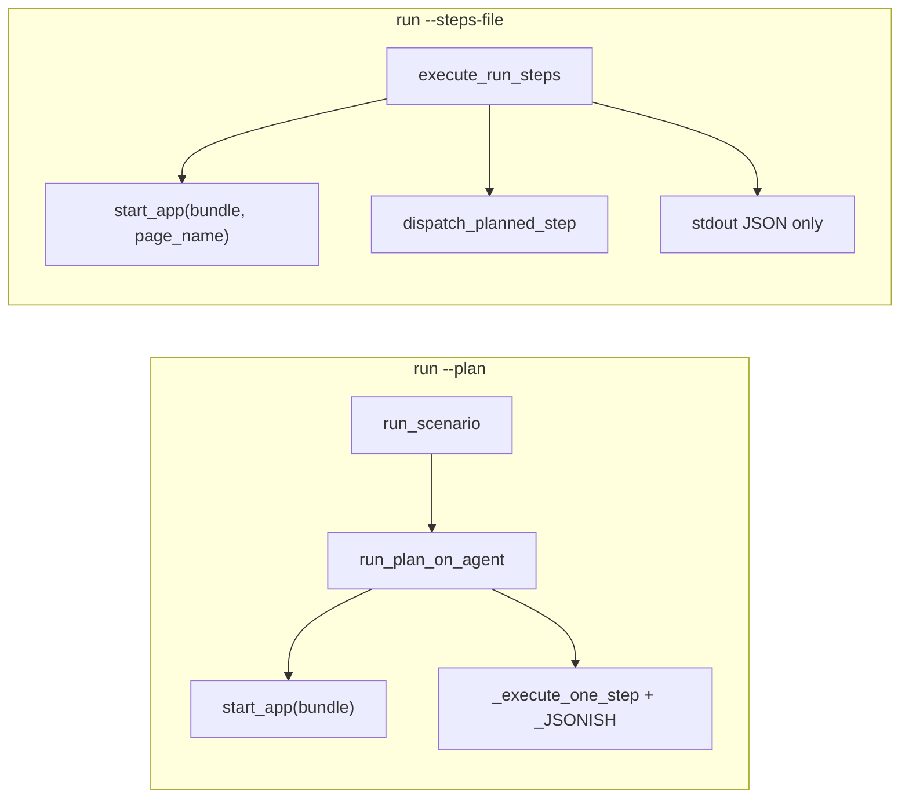
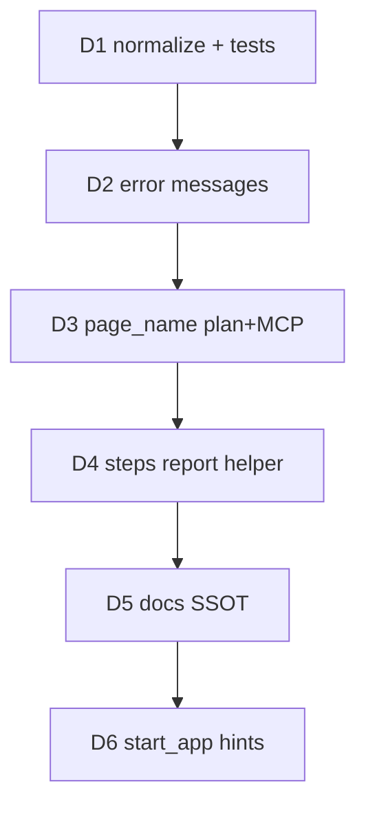

# Hylyre Framework 集成优化计划

## 背景与现状（代码核对）

Framework（Skill 6）通过子进程调用 Hylyre，典型命令：

- `python -m hylyre run --plan <test-plan.md> --feature … --report-out … --trace-out … [--bundle …]`
- `python -m hylyre run --steps-file <steps.json> [--bundle … --page-name …]`
- 环境变量 `HYLYRE_APP_STORE_DIR=…/doc/app-snapshot-cache`

当前两条 batch 路径**共用** [`hylyre/cli/__main__.py`](hylyre/cli/__main__.py) 的 `run_plan_batch` callback，但**接线不对称**：



| 问题 ID | Framework 描述 | 代码现状 | 优先级 |
|---------|----------------|----------|--------|
| B1/D1 | Markdown 反引号导致步骤不被识别为 JSON | [`_JSONISH`](hylyre/scenario/runner.py) 要求整行 `{…}`；`` `{"touch":…}` `` 不匹配；无 `normalize_planned_step_text` | **P0** |
| B1/D2 | 无 VLM 时错误示例只展示 `action` 包裹格式 | [`_execute_one_step`](hylyre/scenario/runner.py) L176–179 示例为 `` `{"action":…}` ``；`JSONDecodeError` 无友好包装 | **P0** |
| B2/D3 | `run --plan` 不传 `page_name` | CLI 已声明 `--page-name` 但 plan 分支未传入；[`run_plan_on_agent`](hylyre/scenario/runner.py) L91–92 仅 `start_app(bundle)`；steps 路径已支持 | **P1** |
| B3/D4 | `--steps-file` 无 report/trace | steps 分支 L303–343 提前 exit，忽略 `feature`/`report-out`/`trace-out`；[`write_run_artifacts`](hylyre/report/emit.py) 仅 plan 路径调用 | **P2** |
| B4/D5 | 文档示例混用 direct / action | [`docs/agent-plan-a.md`](docs/agent-plan-a.md) 表格以 `action` 为主；fixture [`json-steps-test-plan.md`](tests/e2e/fixtures/json-steps-test-plan.md) 已用 direct 根键 | **P2** |
| D6 | `start_app` 失败缺少 `--page-name` 提示 | [`HylyreAgent.start_app`](hylyre/api/agent.py) 直接透传 driver，无增强错误 | **P3** |

**执行语义不变**：[`dispatch_planned_step`](hylyre/api/step_dispatch.py) 已同时支持 `touch`/`input` 等 direct 根键与 `action` 信封；优化集中在**解析宽容 + 错误可读 + CLI 对齐**。

**非 Hylyre 职责**（Framework 侧，本仓不实现）：`bm dump` 发现 MainAbility、`app-snapshot-cache` 注入、plan lint、adhoc harness 门禁。

---

## D1 + D2（P0）：Plan 步骤文本规范化与分层错误

### 实现

1. 新增 [`hylyre/scenario/step_text.py`](hylyre/scenario/step_text.py)（或放在 `runner.py` 顶部，若保持单文件更简单）：

```python
def normalize_planned_step_text(raw: str) -> str:
    s = raw.strip()
    # 剥单层/双层反引号
    if len(s) >= 2 and s[0] == "`" and s[-1] == "`":
        s = s[1:-1].strip()
        if len(s) >= 2 and s[0] == "`" and s[-1] == "`":
            s = s[1:-1].strip()
    # 借鉴 vlm/json_extract：```json fence、{…} 子串提取
    ...
    return s
```

2. 在 [`_execute_one_step`](hylyre/scenario/runner.py) 中：

   - `s = normalize_planned_step_text(step)`（在 `_iter_steps` 之后、`_JSONISH` 之前）
   - `_JSONISH.match(s)` → `json.loads` 包在 `try/except JSONDecodeError`，抛出：
     - `{case_id}: 测试步骤 JSON 语法错误: …` + 截断原文
   - 非 JSON 且无 VLM 的 `ValueError` 改写为：
     - 提示：若步骤本是 JSON，检查**反引号/围栏**是否包裹了整个对象
     - 合法示例并列：`{"touch":{"by_text":"…"}}` **或** `{"action":{"type":"touch","by_text":"…"}}`
     - **不要**在错误示例里再用反引号包裹 JSON（避免二次误导）

3. **可选防御**（D1 表格列）：在 [`plan_parse._split_row`](hylyre/scenario/plan_parse.py) 对每个 cell 调用同一 normalize（剥 cell 级 `` ` ``），与 runner 双保险。

4. **不改动** `_DISPATCH_BY_ROOT` / `dispatch_planned_step` 逻辑。

### 测试（[`tests/unit/test_scenario_runner_agent.py`](tests/unit/test_scenario_runner_agent.py)）

| 用例 | 期望 |
|------|------|
| `` `{"touch":{"by_text":"OK"}}` `` | 与无反引号等价，走 `planned_json` |
| `` ```json\n{"back":{}}\n``` `` | 解析成功 |
| `{broken` | 友好 `JSONDecodeError` 文案含 `case_id` |
| 反引号 JSON + 无 VLM | 不应误走 `ai_action` |

---

## D3（P1）：`run --plan` 贯通 `--page-name`（及 `--wait-time`）

### 改动链

| 层 | 文件 | 改动 |
|----|------|------|
| CLI callback | [`hylyre/cli/__main__.py`](hylyre/cli/__main__.py) | `run_scenario(..., page_name=page_name, wait_time=start_wait_time)` |
| 命令层 | [`hylyre/cli/commands/run_cmd.py`](hylyre/cli/commands/run_cmd.py) | `run_scenario` / `execute_scenario` / `_run_on_device` 增加 `page_name`, `wait_time`, `params`（可选，默认 `""`） |
| Runner | [`hylyre/scenario/runner.py`](hylyre/scenario/runner.py) | `run_plan_on_agent(..., page_name=..., wait_time=...)`；`await agent.start_app(bundle, page_name=page_name, wait_time=wait_time)`；`tool_log` 记录 `page_name` |
| MCP | [`hylyre/mcp/server.py`](hylyre/mcp/server.py) | `hylyre_run_plan` 增加 `page_name` / `wait_time` 参数并透传 |
| 文档 | [`docs/agent-plan-a.md`](docs/agent-plan-a.md)、[`AGENTS.md`](AGENTS.md) | `--page-name` 说明改为 plan/steps 通用；示例：`hylyre run --plan … --bundle x --page-name MainAbility` |

### 验收

- `hylyre run --plan … --bundle <B> --page-name MainAbility` 冷启成功（无需 Framework 侧 `hdc aa start` 兜底）
- 与 [`steps_cmd.execute_run_steps`](hylyre/cli/commands/steps_cmd.py) L133–139 行为一致

---

## D4（P2）：`--steps-file` + report/trace 可选合成

### 设计原则

- **无** `--report-out`/`--trace-out`/`--feature`：保持现有行为（stdout/`--out` 步骤 JSON）
- **有** 三者（与 plan 模式一致，可要求 `--feature` + `--report-out` + `--trace-out` 同时出现）：走报告合成路径

### 实现

1. 新增 [`hylyre/scenario/steps_report.py`](hylyre/scenario/steps_report.py)（名称可调整）：

   - `steps_batch_to_scenario_result(*, feature, steps_path, batch: dict, bundle, page_name) -> ScenarioRunResult`
   - 构造**合成** [`ParsedPlan`](hylyre/scenario/plan_parse.py)：
     - `path` = `steps_file` 路径
     - 每个 batch `results[]` 项映射为一个 [`TestCase`](hylyre/scenario/plan_parse.py)：
       - `case_id`: `STEP-{index:03d}` 或 `adhoc-{index}`
       - `name`: `json.dumps(step)` 截断
       - `steps` / `expected` / `preconditions` 填空或 `"-"`
       - `priority`: `"P2"`，`ac_ref`: `""`
     - `status`: `ok` → `"通过"`，`error` → `"失败"`，`notes` = `error` 字段
   - `tool_calls`: 含 `start_app`（若 bundle）+ 可选逐步 `planned_json` 摘要

2. [`hylyre/cli/__main__.py`](hylyre/cli/__main__.py) steps 分支：

   - 若用户提供 report 三件套 → 调用 helper → [`write_run_artifacts`](hylyre/report/emit.py) → [`verify_report`](hylyre/cli/commands/run_cmd.py)
   - `artifacts.plan` 在 trace 中指向 steps 文件路径（与 plan 路径字段语义对齐，Framework 可读 `cases[]`）

3. [`docs/agent-plan-a.md`](docs/agent-plan-a.md) §2.3 更新：steps-file **可选** 产出与 plan 同 schema 的 `test-report.md` + `trace.json`（Skill 6 统一合成）。

### trace 契约对齐

[`_trace_object`](hylyre/report/emit.py) 已输出 `schema_version: 0.2-p4` + `cases[{id, status, priority, ac_ref, notes}]`，与 [`hylyre/contracts/output-schema.json`](hylyre/contracts/output-schema.json) 及 Framework consumer 一致。

### 验收

- `hylyre run --steps-file nav.json --feature wallet-x --report-out r.md --trace-out t.json --bundle …` 产出可通过 `hylyre report verify`
- Framework 可读取 `trace.json` 的 `cases[]`

### MCP（可选同 PR）

- `hylyre_run_steps` 增加可选 `report_out`/`trace_out`/`feature`，内部复用同一 helper

---

## D5（P2）：文档 SSOT — Canonical direct 根键

### 改动

| 文件 | 动作 |
|------|------|
| [`docs/agent-plan-a.md`](docs/agent-plan-a.md) | §2 明确：**推荐** direct 根键（`touch`/`input`/…）；`action` 为等价信封；表格示例优先 direct；**禁止**在步骤列使用 markdown 反引号；禁止把 CLI 子命令名（`tap`/`swipe`）当作 JSON 根键 |
| [`.cursor/rules/hylyre-plan-a.mdc`](.cursor/rules/hylyre-plan-a.mdc) | 与上文同步（示例顺序：touch 在前，action 标注为可选） |
| [`tests/e2e/fixtures/json-steps-test-plan.md`](tests/e2e/fixtures/json-steps-test-plan.md) | 可增加一行带反引号的**负例注释**（说明 normalize 后仍应通过），或单独 unit fixture |
| [`docs/framework-simulated-wallet-hylyre.md`](docs/framework-simulated-wallet-hylyre.md) | 增补一节「Framework 集成注意」：反引号、`--page-name`、steps-file 报告模式（链到 agent-plan-a） |

---

## D6（P3）：`start_app` 失败提示

在 [`HylyreAgent.start_app`](hylyre/api/agent.py) 或 [`hypium/driver.py`](hylyre/drivers/hypium/driver.py) 的 `start_app` 包装层：

- `try/except` 捕获 driver 异常后 `raise … from e`，附加文案：
  - 若 `page_name is None`：建议 `--page-name <Ability>` 或 plan 内 `{"start_app":{"bundle":"…","page_name":"…"}}`
  - 或 Framework 预启：`hdc shell aa start -a <Ability> -b <bundle>`

避免泄露过长 Hypium 栈；保留 `__cause__`。

---

## 实施顺序与风险



| 风险 | 缓解 |
|------|------|
| normalize 过宽误剥合法 JSON 字符串内的反引号 | 仅剥**整行**首尾反引号 + fence；`json.loads` 仍严格 |
| D4 合成 case 与 Framework 期望 id 格式不一致 | 文档约定 `STEP-NNN`；必要时加 `--case-prefix`（非必须，可后续） |
| plan 路径 `--wait-time` 与 steps 默认值不一致 | 统一默认 `1.0`，与现有 steps Option 一致 |

---

## 建议 PR 切分

1. **PR1（P0）**：D1 + D2 + 单元测试  
2. **PR2（P1）**：D3 + MCP + 文档一句  
3. **PR3（P2）**：D4 + D5 + compat 烟测（`--use-fakes` 可对合成 plan 跑 verify）  
4. **PR4（P3）**：D6（可并入 PR2 若改动很小）
