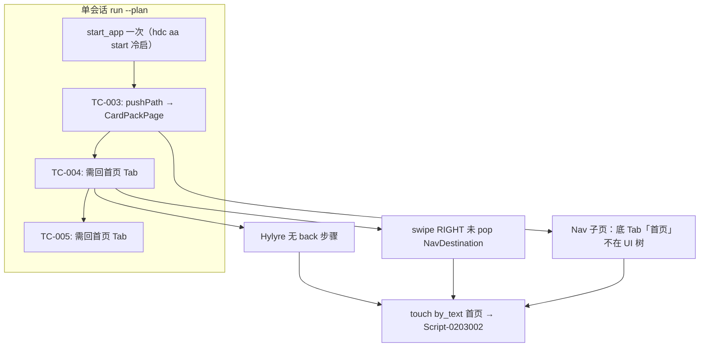

# Hylyre 补全 Hypium 能力 — 根因、差距清单与改进计划

> 计划文件：`C:\Users\shengqsq\.cursor\plans\hylyre_back_能力_8baef473.plan.md`

## 1. 根因结论（已核实）

失败**不完全是** framework 写错 JSON，而是 **三层叠加**：




| 轮次     | 派生计划                         | 实际失败点                                         |
| ------ | ---------------------------- | --------------------------------------------- |
| **v2** | `{"action":{"name":"back"}}` | `Unsupported action type: None` — 无 `back` 类型 |
| **v3** | `swipe RIGHT` + `touch 首页`   | swipe 成功，但 `touch 首页` 失败（子页无 Tab 文案）          |


证据：`[20260519-rerun-v3/hylyre/trace.json](d:/1.code/SimulatedWalletForHmos/doc/features/home-page/testing/reports/20260519-rerun-v3/hylyre/trace.json)`

Framework 误导：`[profile-addendum.md](d:/1.code/SimulatedWalletForHmos/framework/profiles/hmos-app/skills/6-device-testing/profile-addendum.md)` L90 写了从未支持的 `{"action":{"name":"back"}}`。

---

## 2. Hylyre 今天暴露了什么（基线）

对比环境：`SimulatedWalletForHmos/.hylyre/venv` 内 **hypium 6.0.7.210**，`UiDriver` 共 **109** 个公开方法。

### 2.1 已封装在 HypiumDriver、且有 CLI/MCP 路径


| 能力    | Hypium API                                    | Hylyre 驱动   | planned JSON         | CLI/MCP                             |
| ----- | --------------------------------------------- | ----------- | -------------------- | ----------------------------------- |
| 连接/断开 | `connect` / `close`                           | 内部          | —                    | session                             |
| 点按    | `touch`（仅 `mode=normal`）                      | ✓           | `touch`              | `run tap` / `hylyre_run_tap`        |
| 输入    | `input_text` / `input_text_on_current_cursor` | ✓           | `input`              | `run input`                         |
| 方向滑   | `swipe`                                       | ✓           | `swipe`              | `run swipe`                         |
| 滚轮滚   | `mouse_scroll`                                | ✓           | `scroll`             | `run scroll`                        |
| 截图    | `capture_screen`                              | ✓           | —                    | `screenshot`                        |
| UI 树  | `UiTree.refresh`                              | ✓ `dump_ui` | —                    | `dump-ui` / `find` / `collect-list` |
| 启动应用  | `start_app`                                   | ✓           | **未进 step_dispatch** | `run start-app` / `--bundle`        |
| 装包    | `install_app`                                 | ✓（非 ABC）    | —                    | `device install`（走 hdc，非 Hypium）    |


### 2.2 planned JSON 白名单（今天）

`[step_dispatch.py](hylyre/api/step_dispatch.py)`：**仅** `action` / `touch` / `input` / `swipe` / `scroll`。

`action.type`：**仅** `touch` / `input` / `swipe` / `scroll`。

---

## 3. Hypium 有、Hylyre 未暴露 — 完整差距清单

图例：**驱动** = HypiumDriver 是否封装；**步骤** = planned JSON / step_dispatch；**CLI** = 原子 CLI/MCP。

### Tier A — 建议本次一并做（直接解 TC-004/005 + 常见 plan 缺口）


| Hypium 方法                          | 典型用途                     | 驱动  | 步骤  | CLI | 建议 JSON                                               |
| ---------------------------------- | ------------------------ | --- | --- | --- | ----------------------------------------------------- |
| `press_back` / `go_back`           | 系统返回 / Nav pop           | ✗   | ✗   | ✗   | `{"back":{}}` 或 `{"back":{"times":1}}`                |
| `swipe_to_back`                    | 边缘滑返回（备选）                | ✗   | ✗   | ✗   | 合并进 `back`：`{"back":{"mode":"swipe","side":"RIGHT"}}` |
| `press_home` / `go_home`           | 回桌面/宿主                   | ✗   | ✗   | ✗   | `{"home":{}}`                                         |
| `stop_app`                         | 杀进程，硬重置会话                | ✗   | ✗   | ✗   | `{"stop_app":{"bundle":"com.xxx"}}`                   |
| `clear_app_data`                   | 清数据冷态                    | ✗   | ✗   | ✗   | `{"clear_app":{"bundle":"com.xxx"}}`                  |
| `wait`                             | 固定等待（v2 曾误用 wait action） | ✗   | ✗   | ✗   | `{"wait":{"seconds":1.5}}`                            |
| `wait_for_component`               | 等元素出现                    | ✗   | ✗   | ✗   | `{"wait_for":{"by_text":"钱包","timeout":10}}`          |
| `wait_for_component_disappear`     | 等元素消失                    | ✗   | ✗   | ✗   | `{"wait_gone":{"by_text":"加载中","timeout":10}}`        |
| `wait_for_idle`                    | 等 UI 空闲                  | ✗   | ✗   | ✗   | `{"wait_idle":{"timeout":10}}`                        |
| `check_toast` / `get_latest_toast` | 断言 Toast（TC-006/009）     | ✗   | ✗   | ✗   | `{"assert_toast":{"text":"…","timeout":3}}`           |
| `start_app` 进 plan                 | 用例内重启                    | ✓   | ✗   | 部分  | `{"start_app":{"bundle":"…","page_name":"…"}}`        |


**Tier A 共 11 类 planned 步骤**（`back`/`home`/`stop_app`/`clear_app`/`wait`/`wait_for`/`wait_gone`/`wait_idle`/`assert_toast`/`start_app`；`back` 可选 swipe 模式）。

### Tier B — 高价值但可第二批（手势变体）


| Hypium 方法                                | 典型用途              | 驱动  | 步骤  | 建议 JSON                                                                     |
| ---------------------------------------- | ----------------- | --- | --- | --------------------------------------------------------------------------- |
| `long_click`                             | 长按菜单              | ✗   | ✗   | `{"long_press":{"by_text":"…","duration":2}}`                               |
| `double_click`                           | 双击                | ✗   | ✗   | `{"double_tap":{"by_text":"…"}}`                                            |
| `drag`                                   | 拖拽排序/滑块           | ✗   | ✗   | `{"drag":{"from":{"by_text":"A"},"to":{"by_text":"B"}}}`                    |
| `touch` 的 `mode`/`scroll_target`         | 在 Scroll 内点击      | 部分  | ✗   | 扩展 `touch`：`{"touch":{"by_text":"…","scroll_target":{"by_type":"Scroll"}}}` |
| `fling`                                  | 快速甩动列表            | ✗   | ✗   | `{"fling":{"direction":"UP","area":{"by_type":"Scroll"}}}`                  |
| `slide`                                  | 定点滑动              | ✗   | ✗   | `{"slide":{"from":…,"to":…}}`                                               |
| `press_key`                              | 任意键（KeyCode 330+） | ✗   | ✗   | `{"key":{"code":"BACK"}}` 或 `{"key":{"code":2}}`                            |
| `swipe_to_home` / `swipe_to_recent_task` | 系统手势导航            | ✗   | ✗   | 可并入 `home` / 独立 `recent`                                                    |


### Tier C — 暂不建议进 planned JSON（CLI/调试向）


| 类别      | Hypium 方法                                                               | 说明                                        |
| ------- | ----------------------------------------------------------------------- | ----------------------------------------- |
| 图像/OCR  | `find_image`, `touch_image`, `check_image_exist`                        | 需模板图；与 VLM 路径重叠                           |
| 窗口      | `find_window`, `check_window`, `get_current_window`                     | 桌面/多窗口场景                                  |
| 文件      | `push_file`, `pull_file`                                                | 已有 hdc；CLI 即可                             |
| Shell   | `shell`                                                                 | 调试用；安全面大                                  |
| 设备      | `wake_up_display`, `unlock`, `get_display_size`, `set_display_rotation` | 环境准备，非业务步骤                                |
| 多指/笔    | `multi_finger_touch`, `pinch_in/out`, `pen_`*, `touchpad_*`             | niche                                     |
| 监听      | `start_listen_toast`, `start_listen_ui_event`                           | 高级；`assert_toast` 更简单                     |
| 断言框架    | `Assert.*`, `check_component*`                                          | Hypium 内置断言；Hylyre 有 `ai_assert` + report |
| 性能/Hook | `add_hook`, `set_sleep_time`, perf_tag                                  | 非功能测试主路径                                  |


### 已通过其他 Hylyre 模块间接覆盖


| Hypium                                   | Hylyre 替代                              |
| ---------------------------------------- | -------------------------------------- |
| `find_component` / `find_all_components` | `dump-ui` + `find` + `app find`        |
| `check_component_exist`                  | agent 循环里 dump 后判断；或新增 `wait_for`      |
| `current_app` / `has_app`                | 可后续 CLI `device current-app`；非 plan 必需 |
| `install_app`                            | `hylyre device install`（hdc）           |


---

## 4. 本次实施范围（推荐 Tier A）

用户意图：**除 back 外，Hypium 有而 Hylyre 无的常用能力一并纳入 planned JSON**。

**本次做 Tier A**；Tier B 单列 follow-up issue/PR，避免一次改 30+ 文件难以 review。

### 4.1 驱动层

`[hylyre/drivers/base/ui_driver.py](hylyre/drivers/base/ui_driver.py)`、`[hypium/driver.py](hylyre/drivers/hypium/driver.py)`、`[fake_ui_driver.py](tests/contract/fakes/fake_ui_driver.py)`

新增 async 方法（Fake 记录 events）：

- `press_back(*, times=1, mode="key"|"swipe", side="RIGHT")` — 内部 `press_back`/`go_back`/`swipe_to_back`
- `press_home()`
- `stop_app(bundle, wait_time=0.5)`
- `clear_app_data(bundle)`
- `wait_seconds(seconds)`
- `wait_for_selector(by_*, timeout)` / `wait_for_gone(...)` / `wait_for_idle(...)`
- `assert_toast(text, timeout, fuzzy="equal")`

`start_app` 已有 — 仅需 **纳入 step_dispatch**。

### 4.2 Agent + step_dispatch

`[step_dispatch.py](hylyre/api/step_dispatch.py)` 扩展根键：

```
back, home, stop_app, clear_app, wait, wait_for, wait_gone, wait_idle, assert_toast, start_app
```

`[agent.py](hylyre/api/agent.py)` `_apply_action_block` 同步扩展 `action.type`。

`back` payload 示例：

```json
{"back":{}}
{"back":{"times":2}}
{"back":{"mode":"swipe","side":"RIGHT","times":1}}
```

### 4.3 CLI / Session / MCP

每个 Tier A 步骤：`hylyre run <name>` + `hylyre_run_<name>` + session `run_<name>`。

`hylyre_run_steps` / `run --steps-file` 自动识别新根键。

### 4.4 文档

- `[docs/agent-plan-a.md](docs/agent-plan-a.md)`：7 列表 + **§Hypium 步骤能力（Tier A）** schema 表
- `[AGENTS.md](AGENTS.md)`、`[hylyre-plan-a.mdc](.cursor/rules/hylyre-plan-a.mdc)`
- 修正 SimulatedWalletForHmos `[profile-addendum.md](d:/1.code/SimulatedWalletForHmos/framework/profiles/hmos-app/skills/6-device-testing/profile-addendum.md)` 示例

### 4.5 Framework v4 派生计划（Hylyre 发版后）

TC-004 预期步骤：

```json
{"back":{}} ; {"touch":{"by_text":"首页"}} ; {"touch":{"by_text":"添加管理卡片"}}
```

验收：同等设备重跑 → TC-004/005 通过，P0 **8/8**。

---

## 5. 风险


| 风险                                        | 缓解                                                  |
| ----------------------------------------- | --------------------------------------------------- |
| `press_back` vs `go_back` 行为差异            | 实现时优先 `press_back()`；真机 A/B                         |
| `swipe_to_back` 仍可能无效                     | plan 文档写明：Nav 子页优先 `back.mode=key`                  |
| Tier A 步骤过多一次 PR 过大                       | 驱动+dispatch 一个 PR；CLI/MCP 同 PR；framework 派生另 commit |
| `assert_toast` 与 `--skip-assert-expected` | runner 对 toast 断言步骤可配置 skip（与 ai_assert 对齐）         |


---

## 6. 不建议

- 继续用全屏 `swipe RIGHT` 当返回（v3 已证伪）
- 109 个 Hypium 方法全量暴露 — 按 Tier 分批
- Tier C（shell/图像/多指）塞进 planned JSON — 维护成本高

---

## 7. Tier B  backlog（本次不做，已登记）

- `long_press` / `double_tap` / `drag`
- `touch.scroll_target` 扩展
- `fling` / `slide`
- `press_key` / `KeyCode` 枚举文档化

