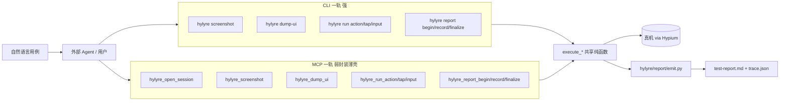

# Hylyre VLM 解耦演进策略（增量路线）

## 现状判定

- 协议层已经允许“VLM 可选”：[hylyre/api/agent.py](hylyre/api/agent.py) 第 12-46 行，`vlm: VlmClientBase | None`。
- 真正硬依赖 VLM 的只有 `ai_action / ai_assert / ai_query / ai_tap(instruction=...) / ai_input(instruction=...) / ai_locate`（同文件 198-339）。
- 不依赖 VLM 的执行入口已经存在：`run_planned_action / run_planned_tap / run_planned_input`（同文件 163-196）。
- 真正与你期望脱节的位置在 **MCP 暴露面**和 **plan 流水线**：
  - [hylyre/mcp/server.py](hylyre/mcp/server.py) 只暴露了批处理 `hylyre_run_plan` 与 `hylyre_ai_`*。
  - 没有给外部 Agent 留「看一眼当前页 + 单步驱动 + 增量记录」的入口，导致外部 Agent 想做 planner 也接不进去。
- `HttpVlmClient`（[hylyre/vlm/http_vlm.py](hylyre/vlm/http_vlm.py)）是“一种默认实现”，不是协议要求。

结论：**不需要改协议，也不必移除 HttpVlmClient**；要做的是补齐 MCP 暴露面与 skill/文档，让外部 Agent 能驱动循环。

## 演进目标（不破坏已上线能力）

1. 任何 Agent（多模态或非多模态）都能用 Hylyre：多模态用截图，非多模态用控件树。
2. 「做法 A」批处理 plan 与新「原子循环」并存，互不替代。
3. `HYLYRE_VLM_*`、`hylyre_ai_*` 保留为可选；新接入推荐**不**配 VLM。
4. 中立性：MCP 工具签名不绑定 Cursor，描述写清楚“面向任意外部 Agent”。
5. **强 CLI / 弱封装 MCP 双轨制**：每一项新能力先以 `execute_*` 纯函数 + `run_*` Typer 命令落到 CLI；MCP 工具是薄壳直接调用 `execute_*`。CLI 与 MCP 共享同一组逻辑，能力对等。

## 双轨制总原则（约束本次所有改动）

参照仓库现有写法（[hylyre/cli/commands/run_cmd.py](hylyre/cli/commands/run_cmd.py) `execute_scenario` ↔ `run_scenario`，[hylyre/cli/commands/doctor.py](hylyre/cli/commands/doctor.py) `gather_doctor_checks` + `format_doctor_plain`，[hylyre/mcp/server.py](hylyre/mcp/server.py) 一律调 `execute_*`）：

- 所有新增能力按「数据/逻辑层 → CLI 层 → MCP 薄壳」三段写：
  - 数据/逻辑：`execute_<x>(...)` 纯函数，不依赖 typer，可同时接受路径（CLI 用）与内存 dict（MCP 用）作为状态载体。
  - CLI：`run_<x>(...)` 处理 typer 错误码与终端输出；`cli/__main__.py` 注册 Typer 命令。
  - MCP：在 `mcp/server.py` 的 `@mcp.tool` 中**直接调 `execute_<x>`**，不做业务分支。
- 不允许出现「能力只在 MCP 暴露，不在 CLI 暴露」的情况；唯一例外见下条。
- **session 是 MCP-only 的连接复用便利层，不进入 CLI**：CLI 每条命令进程内自洽地 `connect → 操作 → close`；MCP 在 `build_mcp` 闭包里维护 `_sessions: dict[str, _Session]`。能力上 CLI 可以做的事，MCP 里加上 session_id 也能做；MCP 不会因此多出 CLI 不具备的能力。
- 增量报告状态载体：CLI 用磁盘 `trace.json`，MCP 用 session 内存 dict；两者共用同一组 `execute_report_begin / record / finalize`，函数签名同时支持「`trace_path: Path` 或 `trace_state: dict`」。

## 目标数据流（演进后，双轨同源）

## 阶段一：双轨原子能力（增量、可向后兼容）

按「`execute_*` → `run_*` → MCP 薄壳」三段顺序落地；不动 [hylyre/api/agent.py](hylyre/api/agent.py) 已有 `run_planned_*` / `screenshot` 行为。

### 1. 协议层（共享）

- [hylyre/drivers/base/ui_driver.py](hylyre/drivers/base/ui_driver.py)：加 `async def dump_ui(self) -> dict`（默认 `NotImplementedError`，避免破坏已有 fakes 测试）。
- [hylyre/drivers/hypium/driver.py](hylyre/drivers/hypium/driver.py) 实现 dump_ui：优先 Hypium hierarchy；不可用则 fallback `hdc uitest dumpLayout` + XML→JSON。
- [hylyre/api/agent.py](hylyre/api/agent.py) 加 `async def dump_ui(self)` 直接转发 `self._ui.dump_ui()`，不引入 VLM。

### 2. CLI 一轨（强 CLI，先于 MCP 落地）

新增/扩充 [hylyre/cli/commands/run_cmd.py](hylyre/cli/commands/run_cmd.py)（或拆 `device_actions_cmd.py` / `report_cmd.py`，按代码量决定）。所有新函数都成对：`execute_*` 纯逻辑 + `run_*` typer 包装。

- 视觉/事实源（无状态命令，每次内部 `connect → 抓取 → close`）：
  - `hylyre screenshot --out shot.jpg [--device-sn ...] [--format jpeg|png] [--quality 70]`
  - `hylyre dump-ui --out tree.json [--device-sn ...]`
- 原子执行（无状态命令）：
  - `hylyre run action --json '{"action":...}' [--device-sn ...] [--bundle ...]`
  - `hylyre run tap --json '{"touch":...}'`
  - `hylyre run input --json '{"input":...}'`
  - `hylyre run start-app --bundle <id> [--page-name ...] [--params ...]`
- 增量报告（状态载体 = `trace.json` 文件）：
  - `hylyre report begin --feature X --trace-out trace.json [--plan path]`：写空骨架。
  - `hylyre report record --trace trace.json --case TC-01 --name "..." --priority P0 --ac AC-01 --status 通过 --notes "..."`：增量追加。
  - `hylyre report finalize --trace trace.json [--plan path] --report-out report.md [--model-backend ...]`：渲染 `report.md` + 跑 `verify_report`（复用 [hylyre/report/emit.py](hylyre/report/emit.py) 与 [hylyre/harness/runner.py](hylyre/harness/runner.py)）。
- `cli/__main__.py` 注册三个新 Typer 子组：`screenshot`、`dump-ui`、`run`（顶层 `hylyre run` 现有 plan 路径保留为 `hylyre run --plan ...`，子命令 `action/tap/input/start-app` 与之并列）；`report` 已存在，加 `begin/record/finalize` 三个子命令。

### 3. MCP 薄壳（弱封装，直接调 execute_\*）

[hylyre/mcp/server.py](hylyre/mcp/server.py) 新增 `@mcp.tool`，**实现体只调 execute_\* + 拼接返回字符串**：

- 单发工具（与 CLI 一对一）：
  - `hylyre_screenshot(device_sn?, format?, quality?)` → `{mime, base64}`（CLI 写文件，MCP 直返字节）。
  - `hylyre_dump_ui(device_sn?)` → 控件树 JSON。
  - `hylyre_run_action / run_tap / run_input(payload, device_sn?, bundle?)`。
  - `hylyre_start_app(bundle, device_sn?, ...)`。
- 增量报告工具（状态 = 内存 dict）：
  - `hylyre_report_begin(feature, plan?) → {trace_state}`。
  - `hylyre_report_record(trace_state, case_id, name, priority, ac_ref, status, notes)` → 更新后的 `trace_state`。
  - `hylyre_report_finalize(trace_state, plan?, report_out, trace_out, model_backend?)` → 复用 [hylyre/report/emit.py](hylyre/report/emit.py) 与 `verify_report`。
- MCP-only 的便利层（不进 CLI）：
  - `hylyre_open_session(device_sn?, bundle?, mock_port?, lyrebird_url?) → {session_id}`：内存里持有一个常驻 `HylyreAgent`，复用 Hypium 连接。
  - `hylyre_close_session(session_id)`。
  - 上述所有「单发工具」与「报告工具」**都额外接受可选 `session_id`**：传了就走 session 内的 agent / trace_state，不传就退化成无状态执行（与 CLI 等价）。
  - 该层只做“连接复用 + 内存 trace 缓存”，不引入新业务能力。

### 4. emit 与 plan 的解耦

[hylyre/report/emit.py](hylyre/report/emit.py) 现有 `write_run_artifacts` 接受的是 `ScenarioRunResult`。增量模式没有 `ParsedPlan`，需要为 emit 新增「无 plan 文件」入口（或允许 `plan: ParsedPlan | None`），并保留现有 plan-A 行为不变。改动点小，仅扩展函数签名 + 在 `_markdown_report` 中处理 `plan is None` 的“计划”行（写 `(ad-hoc)` 之类）。

### 5. 阶段一不动的

- `hylyre_run_plan / hylyre_report_verify / hylyre_ai_*` 全部保留。
- 现有用例与 fixture（[tests/e2e/fixtures/json-steps-test-plan.md](tests/e2e/fixtures/json-steps-test-plan.md)、[tests/e2e/fixtures/mock-test-plan.md](tests/e2e/fixtures/mock-test-plan.md)）继续工作。

## 阶段二：文档 + skill + rule（双轨同时讲清）

让任意外部 Agent / 命令行用户都能用上原子循环。

- 新增 [docs/agent-loop.md](docs/agent-loop.md)：
  - 推荐范式：`(open_session)? → loop(see → plan → run → record) → finalize_report`。
  - **CLI 与 MCP 两套等价示例并列展示**：
    - CLI：`hylyre screenshot` / `dump-ui` / `run action` / `report begin|record|finalize`。
    - MCP：`hylyre_open_session` + `hylyre_screenshot/dump_ui/run_*/report_*`。
  - 多模态 Agent 用 `hylyre_screenshot` 或 `hylyre screenshot`；非多模态用 `hylyre_dump_ui` 或 `hylyre dump-ui`。
  - 选择器优先级 `by_id > by_text > 坐标`；坐标只在前两者都拿不到时使用。
  - 明确“何时需要 VLM”：仅当外部 Agent 完全没有视觉/树能力且不愿做 planner 时，才退回 `hylyre_ai_*` + `HYLYRE_VLM_*`。
- 新增 [.cursor/rules/hylyre-loop.mdc](.cursor/rules/hylyre-loop.mdc)：
  - 触发条件：用户提到“自然语言用例 + 真机/Hylyre”。
  - 默认走原子循环模式；只有当用户**显式**要求批处理时再写 plan 文件走 `hylyre run --plan ...` / `hylyre_run_plan`。
  - 鼓励先 dump-ui 再 screenshot，避免无意义截图。
- 修订 [AGENTS.md](AGENTS.md)：
  - 「每轮对话里你应该怎么做」补一条：**优先原子循环 + 增量记录**；并强调“CLI 与 MCP 能力对等，按当前会话能力选择”。
  - 「最短命令备忘」补 `screenshot / dump-ui / run action / report begin|record|finalize` 的 CLI 一行示例。
- 修订 [docs/agent-plan-a.md](docs/agent-plan-a.md)：开头加一句“做法 A 适合事先就掌握 selector 的场景；不掌握 selector 的场景请用 docs/agent-loop.md 的循环模式（CLI 或 MCP 任一）”。

## 阶段三（可选、记一笔不实现）

- 完全去 plan 文件：把循环模式作为唯一推荐，plan 仅用于回归套件。先看阶段一二落地后的反馈再决定。
- 把“预期结果”自动断言协议化：新增 `hylyre_assert(session_id, predicate, evidence)` 让外部 Agent 把判断结果回写，彻底从 Hylyre 内部移除 `ai_assert` 依赖。`HttpVlmClient` 视使用率再决定是否标 deprecated。

## 风险与开销

- 控件树 dump：Hypium 的 hierarchy 形态需要在真机上探一次；若 Hypium SDK 不直接给，需要走 `hdc uitest dumpLayout`，这会**先于代码实现**做一次实地验证（一两条 hdc 命令即可）。
- Session 与并发：MCP stdio 单连接单进程；阶段一只支持单设备会话；多 session 并发放阶段二再说。
- 截图体积：base64 经由 stdio JSON 传输有体积上限，按需提供 `format="jpeg", quality=70` 等参数压缩，避免大图打爆 MCP 传输。
- 双轨制不对称的“session”：MCP 进程有持久内存，能持有 Hypium 连接；CLI 每次进程独立，无法持有连接。**这是性能/UX 差异，不是能力差异**——CLI 仍能完成同一组操作（每次自己 connect），文档里需要明示这一点，避免被理解成 MCP 比 CLI 多了功能。
- `execute_*` 双载体（路径 vs dict）签名要克制：阶段一只对 `execute_report_*` 三个函数引入这个能力，避免协议层泛滥。
- 现有 fixture/E2E 不会被破坏：所有新工具/命令都是“新增”，原 `hylyre run --plan` / `hylyre_run_plan` / `hylyre_ai_*` 路径完全保留。

