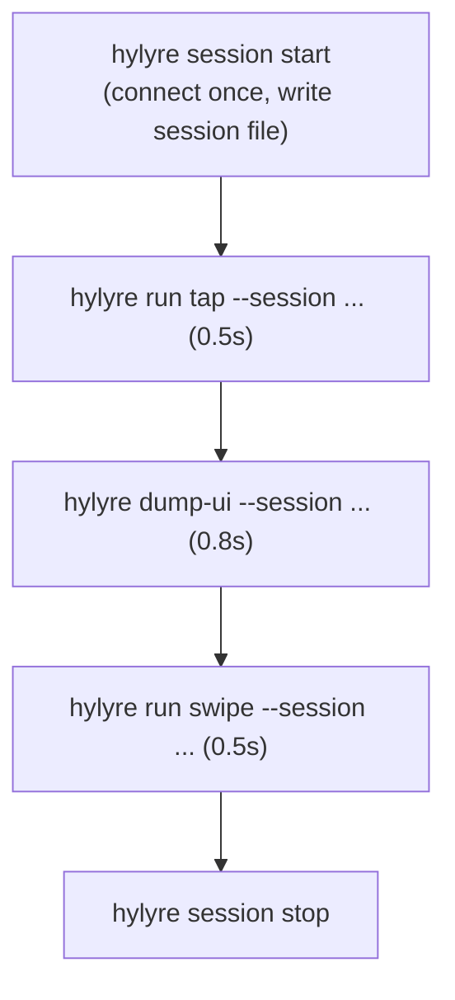
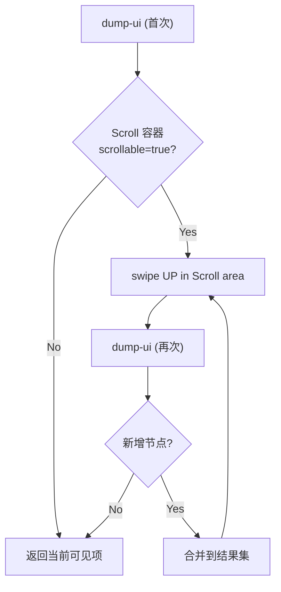

# Hylyre 性能与准确性优化方案

## 问题诊断

### 问题 1：性能（7-8 分钟 vs 人工 5 秒）

**根因**：每条 CLI 命令（`run tap`、`dump-ui`、`start-app`）都走完整的 connect/disconnect 生命周期：

```
EnvPool init → hdc list → uitest version check → agent.so check →
uitest daemon start → tcp forward → 实际操作(0.5s) → close
```

单次连接开销约 **10-12s**；5 条命令 = 55-65s 纯设备 I/O；加上 Agent 思考/工具调用间隔 = 7-8 分钟。

**对比**：`ScenarioRunner.run_plan_on_agent` 中 agent 只 connect 一次，然后逐步跑所有 case。MCP 的 `hylyre_open_session` 也复用连接。但 CLI 原子命令没有这层——每次都是 one-shot。

**业界参考**：

- **Appium**：`noReset` + session 复用 = 35% 提速；suite-level 共享 session
- **Maestro**：`start-session` 命令预热后，后续 `test` 跳过 APK 安装/daemon 启动，速度提升数倍
- **Midscene**：scrcpy 截图模式（100-200ms vs adb 500-2000ms）

### 问题 2：准确性（半屏模态遗漏屏外卡片）

**根因**：Agent 在「非本机卡片」的半屏 Sheet 上 dump-ui 后只看到 3 条交通卡 + 1 条门禁卡（`listIndex0-2` + 一个无 listIndex 的门禁卡），实际有 5 张。dump-ui 树中 `**scrollable: "true"`** 已经暗示有更多内容，但没有自动化机制帮助 Agent 判断「列表未到底」并持续滚动收集。

**现有文档约束**（`docs/agent-loop.md` 第 96-105 行）已经写了正确策略，但缺少 **可编程原语** 让 Agent/框架自动执行「滚到底 + 合并」。

---

## 方案设计

### 方案 A：CLI Session Daemon（解决性能）

参照 Maestro 的 `start-session` 设计，引入 **CLI 持久 session**：




**核心改动**：

1. **新增 `hylyre session start`**：启动后台 daemon 进程（或 socket server），执行一次 Hypium connect，将 session info 写入 pidfile/socket 路径（类似 `hylyre mock start` 的 pidfile 模式）
2. **新增 `--session` 参数**：所有原子命令（`dump-ui`、`run tap`、`run swipe`、`screenshot`）增加 `--session` 可选参数，有此参数时通过 IPC 调用已 connect 的 driver，跳过 connect/close
3. **新增 `hylyre session stop`**：关闭 daemon、disconnect

**预期效果**：单次操作从 12s 降至 **0.5-1.5s**；5 步操作 + 1 次 connect/disconnect = **15s 以内**（含首次 connect 12s）。

**谁来做优化？**


| 层级                                 | 职责                                                                   |
| ---------------------------------- | -------------------------------------------------------------------- |
| **Hylyre**                         | 提供 session 基础设施（CLI daemon / MCP open_session / ScenarioRunner 内置复用） |
| **调用方（framework skill 6 / 外部 AI）** | 在测试会话开始时 `session start`，结束时 `session stop`；中间所有命令带 `--session`      |


SimulatedWalletForHmos 的 skill 6 在 Step 5（执行测试）时，应在第一条命令前 `hylyre session start`，最后 `session stop`。Hylyre 的文档/规则需要指导调用方这样做。

### 方案 B：Scroll-to-Collect 原语（解决准确性）

新增一条高层命令/MCP 工具：`**hylyre collect-list`**




**核心改动**：

1. **新增 `loop_cmd.execute_collect_list`**：
  - 输入：`device_sn`、`scroll_selector`（默认 `by_type: Scroll`）、`item_selector`（如 `TextCardNameHasDetail`）、`max_scrolls`（防死循环，默认 10）
  - 逻辑：dump → 提取匹配项 → 若 scrollable=true 则 swipe UP → 再 dump → 比对新增 → 直到无新增或达到 max_scrolls
  - 输出：合并后的完整项列表 JSON
2. **新增 CLI `hylyre collect-list`** 和 MCP `**hylyre_collect_list**`
3. **文档补充**：在 `agent-loop.md` 增加「自动收集完整列表」节，推荐 Agent 在需要「列出所有」时优先用 `collect-list`，而非手动循环 dump+swipe

**性能与准确性结合**：`collect-list` 内部复用同一个 driver 连接（不管是 session 模式还是 one-shot 模式），每次 swipe+dump 只花 1-2s（因为不断开连接），5 次滚动 = 5-10s 即可完整收集。

### 方案 C：Agent 侧智能判断增强（文档 + 规则改进）

即使不新增 `collect-list` 原语，也应该：

1. 在 `dump-ui` 的输出中**高亮 scrollable 容器**（例如在 JSON schema 里加 `_hylyre_hints` 字段，标记哪些容器 scrollable=true 且 bounds 贴近屏幕底部）
2. 在 `.cursor/rules/hylyre-loop.mdc` 中增加规则：**当 dump-ui 结果中存在 `scrollable=true` 的 Scroll/List 容器，且当前任务涉及「列出所有 / 数数 / 完整信息」时，必须至少执行一次 scroll+dump 校验**

---

## 实施优先级建议


| 优先级 | 改动                                   | 效果                  | 复杂度         |
| --- | ------------------------------------ | ------------------- | ----------- |
| P0  | CLI session daemon（方案 A）             | 性能：12s/cmd → 1s/cmd | 中（需 IPC 机制） |
| P0  | `collect-list` 原语（方案 B）              | 准确性：自动滚到底收集         | 中           |
| P1  | dump-ui 输出加 scrollable hints（方案 C-1） | 帮助 AI 判断是否需滚动       | 低           |
| P1  | 规则/文档补充（方案 C-2）                      | 约束 Agent 行为         | 低           |
| P2  | scrcpy 截图加速（参考 Midscene）             | 截图 500ms→100ms      | 高（需新依赖）     |


**已确认决策**：
- 方案 A IPC 选型：本地 TCP socket（Windows 用 named pipe 兼容），JSON-RPC 协议
- 方案 B 范围：两种都支持（默认通用返回所有带文本叶节点，可选 `item_selector` 按 id/key pattern 过滤）
- 优先级：A + B 一起做

---

## 关于 SimulatedWalletForHmos 的集成

该框架的 `skill 6 (device-testing)` 当前假设测试由人工执行或由 Agent 逐步调用。与 Hylyre 集成时：

- **性能层**：skill 6 的执行阶段应调用 `hylyre session start` 一次，所有 `hylyre run ...` 带 `--session`，最后 `session stop`。这是**调用方**的责任，但 Hylyre 必须提供这个能力。
- **准确性层**：当 test-plan.md 的预期结果要求「列出所有卡片」时，skill 6 应指导 Agent 使用 `hylyre collect-list`（或在 loop 中自行 scroll+dump）。这属于 **Hylyre 提供原语 + 调用方按需使用**。
- **最终目标**：Hylyre 对外应是一个「快速、准确的设备操作 SDK」，不替调用方做测试决策，但提供足够的原语让调用方能快速、准确地完成任务。

