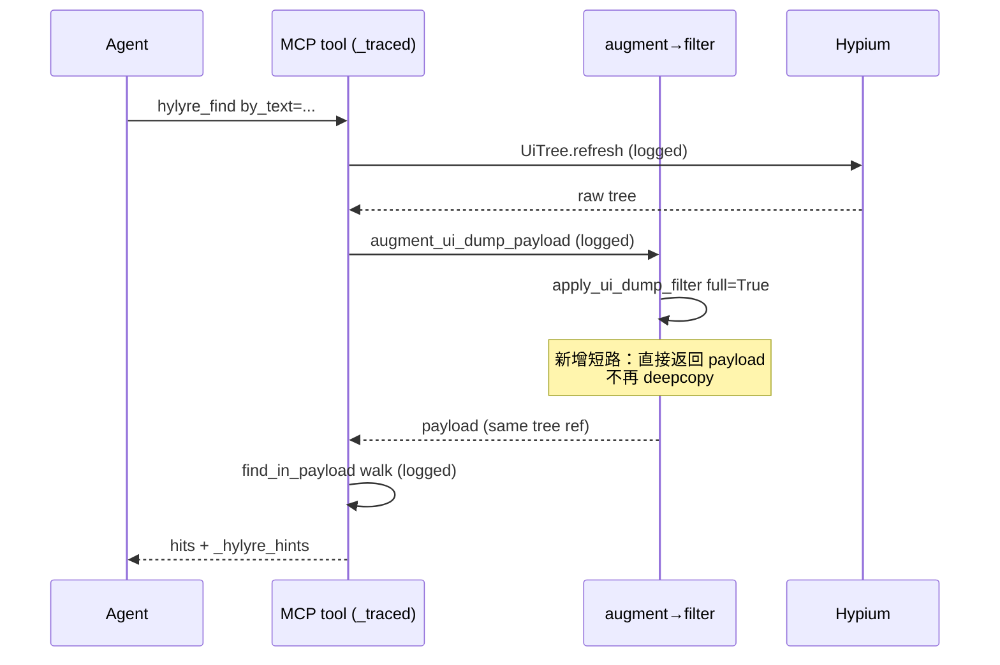

# 钱包用例慢 & 半屏列表反向滑动 — 修复计划

## 背景定位

- 本轮"缓存仍然慢"的真实根因：MCP cwd 默认是 `C:\Users\shengqsq`（见 [C:\Users\shengqsqhylyre\mcp-server.log](C:\Users\shengqsq.hylyre\mcp-server.log)），`hylyre_app_page_save` 也没被调过，**缓存这一轮全程未命中**。慢的来源主要是反复全量 dump + `apply_ui_dump_filter` 里的 `copy.deepcopy(tree)`。
- "一直往下滑"根因：本人调用 `hylyre_collect_list` 时主动开了 `reset_to_top=True` + `bidirectional=True`。8 次迭代里 5 次是 DOWN（在已经触顶的 Sheet 上反复回弹），仅 3 次 UP。`collect_cmd` 的方向逻辑本身没问题，但默认值 + 工具描述容易被滥用。
- 无法量化"对比重构前慢多少"：[hylyre/mcp/server.py:42-55](hylyre/mcp/server.py) 定义了 `_call_logged`，但**所有 `@mcp.tool` 都没真正用它**，日志里只剩 `open_session connected ...s`。

## 改动清单

### 1. 观测先行（必需，所有后续判断都依赖它）

- [hylyre/mcp/server.py](hylyre/mcp/server.py)：用一个 async 装饰器 `_traced(name)` 包住每个 `@mcp.tool` 处理器（含 `hylyre_dump_ui` / `hylyre_find` / `hylyre_run_tap` / `hylyre_collect_list` / `hylyre_start_app` / `hylyre_app_`*），在 `_mcp_log` 里写 `tool_start name=X` / `tool_end name=X elapsed_s=…`。失败也写 `tool_error`。
- [hylyre/drivers/hypium/driver.py](hylyre/drivers/hypium/driver.py) `dump_ui()`：在 `_sync_dump` 前后用 `time.perf_counter()` 把 `uitree.refresh` 单独打日志（这是 device 侧最贵的一段）。
- [hylyre/ui_dump_hints.py](hylyre/ui_dump_hints.py) `augment_ui_dump_payload`：计时一次 walk。
- [hylyre/ui_dump_filter.py](hylyre/ui_dump_filter.py) `apply_ui_dump_filter`：计时 deepcopy / attr policy / summary 三段。
- [hylyre/cli/commands/find_cmd.py](hylyre/cli/commands/find_cmd.py) `find_in_payload`：计时 walk。
- [hylyre/cli/commands/collect_cmd.py](hylyre/cli/commands/collect_cmd.py)：每轮 dump+swipe 各打一条 `collect_list iter=i direction=… dump_ms=… swipe_ms=…`。

> 全部走同一个 `_mcp_log`（已写入 `<cwd>/.hylyre/mcp-server.log`），无需新建日志组件。

### 2. `apply_ui_dump_filter` 短路（明确收益）

[hylyre/ui_dump_filter.py:241-288](hylyre/ui_dump_filter.py) 入口加快速通道：

```python
def apply_ui_dump_filter(payload, spec):
    if (
        spec.full
        and not spec.summary
        and spec.max_depth is None
        and not spec.active_regex_filters()
        and not spec.keep_clickable
        and not spec.keep_scrollable
        and not spec.keep_attrs
        and not spec.prune_attrs
    ):
        return payload  # 调用方期望只读 tree；deepcopy 完全多余
    ...
```

这条覆盖了 [hylyre/mcp/server.py `_live_ui_payload_full](hylyre/mcp/server.py)` 里 100% 的 `find / app_page_save / app_page_diff / app_fingerprint` 调用。

### 3. `collect_list` bounce 快速退出 + 工具描述警告

- [hylyre/cli/commands/collect_cmd.py](hylyre/cli/commands/collect_cmd.py)：在 `_swipe_until_viewport_stable` 与 `_collect_merge_direction` 第 1 次 swipe 后，如果新 fingerprint 与上一轮**完全相同**，立即 break（不再等 `max_stable_rounds`）。可选 `early_bounce_break: bool = True` 默认开。
- [hylyre/mcp/server.py `hylyre_collect_list` description](hylyre/mcp/server.py:635-642) 与 [docs/agent-loop.md](docs/agent-loop.md)、[.cursor/rules/hylyre-loop.mdc](.cursor/rules/hylyre-loop.mdc)、[docs/framework-simulated-wallet-hylyre.md](docs/framework-simulated-wallet-hylyre.md)：补一句**"半屏 Sheet 进入即在顶部，默认不要传 `reset_to_top=True` / `bidirectional=True`；若 dump 显示 `likely_more_content_below` 没置位，整张列表通常已在视口里"**。

### 4. App store dir 落地检查

- [hylyre/mcp/server.py `build_mcp](hylyre/mcp/server.py)` 末尾调一次：

```python
from hylyre.app_store.paths import resolve_write_dir
try:
    wd = resolve_write_dir(None)
    _mcp_log(f"app_store write_dir={wd}")
    if Path.home() in wd.parents and not (Path.cwd() / "pyproject.toml").exists():
        _mcp_log(
            f"app_store_warning cwd={Path.cwd()} not a Hylyre repo; "
            "snapshots will land in your user home. "
            "Set HYLYRE_APP_STORE_DIR or fix Cursor MCP cwd."
        )
except Exception as e:
    _mcp_log(f"app_store_probe_failed {e}")
```

- [docs/cursor-mcp-setup.md](docs/cursor-mcp-setup.md) 与 [docs/app-knowledge.md](docs/app-knowledge.md) 补一节"Cursor 的 MCP `cwd` 必须是 Hylyre 仓库根，否则 `app store` 会落到 `~/.hylyre/apps`，跨进程/跨机器都不可见"。

### 5. 测试

- [tests/unit/test_ui_dump_filter.py](tests/unit/test_ui_dump_filter.py)：新增 `test_full_no_filter_short_circuits_no_copy`，传一个含可识别引用的 tree，断言返回的 `result["tree"] is payload["tree"]`。
- [tests/unit/test_collect_list.py](tests/unit/test_collect_list.py)：新增 `test_first_swipe_bounce_breaks_immediately`，构造一个 Fake agent，让 `dump_ui` 始终返回同一 fingerprint，断言 `iterations_done == 1`。
- [tests/unit/test_app_store_paths.py](tests/unit/test_app_store_paths.py)：补一条断言 cwd 在用户家目录下时，`resolve_write_dir` 仍能成功（不破坏行为），用作回归保护。
- [tests/unit/test_mcp_server.py](tests/unit/test_mcp_server.py)：保持工具数量计数；可选用 monkeypatch 验证至少一个工具走过 `_traced` 日志路径。

## 流程图（修复后）




## 验证步骤（用户跑）

1. 装新版本，重启 Cursor MCP（让 cwd 警告生效）。
2. 把仓库根作为 MCP cwd（参见 [docs/cursor-mcp-setup.md](docs/cursor-mcp-setup.md)）。
3. 复跑钱包用例：进入"批量添加至本机"页后只传 `scroll_by_type=Scroll`，**不传 `reset_to_top` / `bidirectional`**。
4. 看 `<repo>/.hylyre/mcp-server.log`：能直接读到每个工具/每段 dump 的 ms。
5. 把第 3 步页面 `hylyre_app_page_save --auto-fingerprint` 入库；下一轮即应命中缓存。

## 不在本轮范围（数据出来后再讨论）

- `hylyre_find` 在 `by_text` 单条件下改走 Hypium 原生 `find_component(BY.text(...))`，跳过整树 dump。
- 把 `_hylyre_hints` 计算从 `agent.dump_ui()` 推迟到首次访问（lazy），避免每次 dump 都全树扫一遍。
- `collect_list` 自动从 `_hylyre_hints.likely_more_content_*` 推断方向、自动选 scroll container。

