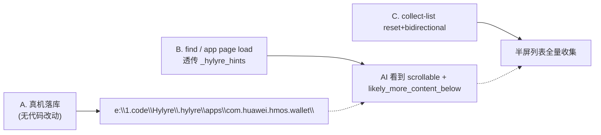

# Wallet Save + Hints Surface + Collect-list Bidirectional

执行 ABC 三件事，闭合 [.cursor/plans/performance_and_accuracy_optimization_db4feaed.plan.md](.cursor/plans/performance_and_accuracy_optimization_db4feaed.plan.md) 留下的两个真实 gap：`find` 不透传 hints、`collect-list` 不能从顶起，并把 `com.huawei.hmos.wallet` 4 个页落库以兑现 [.cursor/plans/app_knowledge_persistence_layer_285b77ac.plan.md](.cursor/plans/app_knowledge_persistence_layer_285b77ac.plan.md) 的「第二轮 ≥50% 降幅」验收。

## 整体策略



A 不改代码、纯生成持久化数据。B 与 C 改少量 Python，加单测，更新文档/规则。三件事彼此独立，可并行实现，但建议按 A → B → C 顺序，便于在 A 落库之后用真实 `home.json` 验证 B 的 hints 透传逻辑。

---

## 任务 A：真机落库 4 个 page snapshot（不改代码）

**目的**：让下次同一用例可以走「`app page load` + `app find` 命中 selector」路径，省掉 3 次整树 `dump_ui`（~6s × 3 ≈ 18s/轮）。

**默认存储位置**（用户已确认走默认链 `<cwd>/.hylyre/apps`）：

```text
e:\1.code\Hylyre\.hylyre\apps\com.huawei.hmos.wallet\
├── index.json
└── pages\
    ├── home.json
    ├── manage_cards.json
    ├── add_card_entries.json
    └── previous_added_cards.json
```

`.hylyre/` 已在 [.gitignore](.gitignore) 第 113 行被忽略，不会污染 git。

**执行脚本（在仓库根 PowerShell）**：

由于 PowerShell 直接传含中文 `--json` 容易乱码，用 `python -c` 包一层（或 cmd /c 配合 ANSI），统一通过 UTF-8 文件读取 JSON：

```powershell
$SF = ".hylyre\wallet-session.json"
$BUNDLE = "com.huawei.hmos.wallet"

python -m hylyre session start --device-sn 3UJ0225327004147 --session-file $SF

# 1. 主页
python -m hylyre run start-app --bundle $BUNDLE --page-name MainAbility -S $SF
python -m hylyre app page save -S $SF --bundle $BUNDLE --name home --ability MainAbility --auto-fingerprint

# 2. 添加管理卡片
python -c "import subprocess,pathlib;j=pathlib.Path('.hylyre/tap_manage_cards.json').read_text(encoding='utf-8').strip();subprocess.check_call(['python','-m','hylyre','run','tap','-S','.hylyre/wallet-session.json','--json',j])"
python -m hylyre app page save -S $SF --bundle $BUNDLE --name manage_cards --auto-fingerprint

# 3. 添加卡片
python -c "import subprocess,pathlib;j=pathlib.Path('.hylyre/tap_add_card.json').read_text(encoding='utf-8').strip();subprocess.check_call(['python','-m','hylyre','run','tap','-S','.hylyre/wallet-session.json','--json',j])"
python -m hylyre app page save -S $SF --bundle $BUNDLE --name add_card_entries --auto-fingerprint

# 4. 非本机卡片
python -c "import subprocess,pathlib;j=pathlib.Path('.hylyre/tap_nonlocal_cards.json').read_text(encoding='utf-8').strip();subprocess.check_call(['python','-m','hylyre','run','tap','-S','.hylyre/wallet-session.json','--json',j])"
python -m hylyre app page save -S $SF --bundle $BUNDLE --name previous_added_cards --auto-fingerprint

python -m hylyre session stop --session-file $SF
```

复用上一轮已生成的 `.hylyre/tap_manage_cards.json` / `tap_add_card.json` / `tap_nonlocal_cards.json`（每个文件就是 `{"touch":{"by_id":"…"}}`）。

**验收**：

```powershell
python -m hylyre app page list com.huawei.hmos.wallet
# 期望: ["add_card_entries","home","manage_cards","previous_added_cards"]
python -m hylyre app find com.huawei.hmos.wallet --by-text "非本机卡片"
# 期望命中 PreviousAddedCardsView.textMessage 并出现在 previous_added_cards
```

---

## 任务 B：`find` / `app page load` 透传 `_hylyre_hints`

**目的**：让走快路径（`find` 而非 `dump-ui`）的 Agent 也能看到「页面有 scrollable 容器、可能还有屏外内容」的信号。

**关键改动文件与位置**：

### 1) [hylyre/cli/commands/find_cmd.py](hylyre/cli/commands/find_cmd.py)

把 `find_in_payload` / `find_live_elements` 的返回从 **裸 list[dict]** 升级为 **dict**：

```python
{"hits": [...], "_hylyre_hints": {...}, "limit": 50}
```

具体：

- `find_in_payload(payload, ...) -> dict[str, Any]`：返回 `{"hits": [...], "_hylyre_hints": payload.get("_hylyre_hints") or {}, "limit": limit, "truncated": bool}`。`hits` 内容不变。
- `find_live_elements(...)` 同步改返回类型；保留 `DumpFilterSpec(full=True)` 走 [hylyre/cli/commands/loop_cmd.py](hylyre/cli/commands/loop_cmd.py) 的 `execute_dump_ui_dict`，确保 `augment_ui_dump_payload` 已经把 hints 拼上。
- `run_find_cli`：`typer.echo(json.dumps(result, ensure_ascii=False))` 直接输出整个 dict。

向后兼容：旧调用方若期望 list 会拿到 dict —— 计划中只 [tests/unit/test_find_cmd.py](tests/unit/test_find_cmd.py) 与 MCP 一处使用，更新它们即可。

### 2) [hylyre/mcp/server.py](hylyre/mcp/server.py) 第 696–730 行 `hylyre_find`

```python
hits = find_in_payload(payload, ...)        # 现在 hits 是 list
return json.dumps(hits, ensure_ascii=False)
```

改为：

```python
result = find_in_payload(payload, ...)      # dict
return json.dumps(result, ensure_ascii=False)
```

并在 `description` 里追加 `"Returns {hits, _hylyre_hints}."`。

### 3) `app page load` 已经直出原 payload 含 `_hylyre_hints`（[hylyre/app_store/page_store.py](hylyre/app_store/page_store.py) 的 `tree` 字段就是 `tree_payload` 整体），**不需改代码**，但需在文档里点明：调用方读 `snap["tree"]["_hylyre_hints"]` 即可拿到滚动信号。

### 4) [docs/app-knowledge.md](docs/app-knowledge.md) + [docs/agent-loop.md](docs/agent-loop.md)

各加 1 段「hints 在 find / load 里也可见」的说明，避免 Agent 误以为只能从 `dump-ui` 拿。

### 5) 单测

在 [tests/unit/test_find_cmd.py](tests/unit/test_find_cmd.py) 新增 1 个用例：构造带 `_hylyre_hints` 的 payload，断言 `find_in_payload` 返回的 dict 里 `_hylyre_hints["scrollable_container_count"] == N`，且 `hits` 仍包含原有命中。

---

## 任务 C：`collect-list` 加 `reset-to-top` 与 `bidirectional`

**目的**：保证「列表完整性」不依赖调用顺序，半屏 Sheet 进入时不论列表当前位置，都能取到全量。

**关键改动文件与位置**：

### 1) [hylyre/cli/commands/collect_cmd.py](hylyre/cli/commands/collect_cmd.py)

`collect_list_on_agent`（第 96 行）增加 2 个参数 + 2 个阶段：

```python
async def collect_list_on_agent(agent, params):
    # 现有 scroll_area / pattern_re / max_scrolls / swipe_distance / stable_need ...
    reset_to_top  = bool(params.get("reset_to_top") or False)
    bidirectional = bool(params.get("bidirectional") or False)

    # Phase 0: optional reset-to-top —— 反复 swipe DOWN 直到 stable_rounds 轮 dump 不变
    if reset_to_top:
        await _swipe_until_stable(agent, scroll_area, "DOWN", swipe_distance, stable_need, max_scrolls)

    # Phase 1: 现有 UP 收集逻辑（不变）
    items, iters_up = await _collect_one_direction(agent, "UP", ...)

    # Phase 2: 可选 DOWN 反向收集；merge 入相同 seen 集合
    iters_down = 0
    if bidirectional:
        iters_down = await _collect_one_direction(agent, "DOWN", items, seen, ...)

    return {
        "items": items,
        "iterations": iters_up + iters_down,
        "iterations_up": iters_up,
        "iterations_down": iters_down,
        "unique_count": len(items),
        "scroll_area": scroll_area,
        "reset_to_top": reset_to_top,
        "bidirectional": bidirectional,
    }
```

`_collect_one_direction(agent, direction, items, seen, ...)` 把现有 122–161 行循环抽出来，参数化方向。

### 2) [hylyre/cli/commands/collect_cmd.py](hylyre/cli/commands/collect_cmd.py) `normalize_collect_params` + `run_collect_list_cli`

- `normalize_collect_params` 增加 `reset_to_top`、`bidirectional` 透传。
- `run_collect_list_cli` 增加 2 个 typer 参数 `--reset-to-top` / `--bidirectional`（默认 False，行为不变）。

### 3) [hylyre/cli/__main__.py](hylyre/cli/__main__.py) `collect_list_cmd`

在 `collect-list` 子命令加同名 typer Option 并转发给 `run_collect_list_cli`。

### 4) [hylyre/mcp/server.py](hylyre/mcp/server.py) `hylyre_collect_list`（第 635 行附近）

参数列表加 `reset_to_top: bool = False` / `bidirectional: bool = False`，并写入 `payload` 字典传给 `collect_list_on_agent` / `execute_collect_list`。description 简短追加 `"Optional reset_to_top + bidirectional for unknown initial scroll position."`。

### 5) [hylyre/session/daemon.py](hylyre/session/daemon.py) 第 56–59 行

`collect_list` 分支已直接 `dict(params)` 透传给 `collect_list_on_agent`，**不需要改**（因为新参数走在 params 字典里）。验证一下 IPC 链路把 `reset_to_top`/`bidirectional` 透到 daemon 即可。

### 6) [docs/agent-loop.md](docs/agent-loop.md)「列表与滚屏」节

新增使用建议：

- 进入半屏 Sheet 后**位置未知**时建议加 `--reset-to-top`；
- 列表很长且尾部信息也关键时加 `--bidirectional`；
- 默认行为不变，避免破坏现有用户。

### 7) 新增 [tests/unit/test_collect_list.py](tests/unit/test_collect_list.py)

mock 一个 fake agent（参考 [tests/contract/fakes/fake_ui_driver.py](tests/contract/fakes/fake_ui_driver.py) 风格，但更轻：自己写一个 dumb agent，按 swipe 调用次数返回不同 dump）：

- **case 1**：reset-to-top 触发 N 次 DOWN，期望 `items` 比仅 UP 多含「顶部条目」。
- **case 2**：bidirectional UP 完成后再 DOWN，验证 `iterations_up + iterations_down == iterations`，且不会重复加入相同 `(id,key,text)` 三元组。
- **case 3**：默认参数（两者都 False）行为与现有一致。

---

## 全量改动清单（按文件，便于实施 AI 跟踪）

实施 AI 走以下顺序：

1. **任务 A（手动 / 真机）**：跑上面 PowerShell 脚本，确认 4 个文件落到 `e:\1.code\Hylyre\.hylyre\apps\com.huawei.hmos.wallet\pages\` 且 `index.json` 元素 ≥ 4。
2. **任务 B**：改 `find_cmd.py` + `mcp/server.py` 的 `hylyre_find` + 单测；`pytest tests/unit/test_find_cmd.py tests/unit/test_mcp_server.py`。
3. **任务 C**：改 `collect_cmd.py` + `cli/__main__.py` `collect-list` + `mcp/server.py` `hylyre_collect_list`；新增 `test_collect_list.py`；跑全量 `pytest tests/unit`。
4. **文档**：`docs/app-knowledge.md`、`docs/agent-loop.md` 各 1–2 段。
5. **手测验证**（可选）：再跑一次「打开钱包 → 添加管理卡片 → 添加卡片 → 非本机卡片 → 数卡片」，对照第一轮记录耗时与 `iterations_up/iterations_down`，预期：
   - 第二轮里 3 处 `find` 可换成 `app find` + 0 次整树 `dump_ui`（手动验证）；
   - `collect-list --reset-to-top --bidirectional` 比之前 4 张多发现至少 1 张（如果设备上原本就有 5 张则印证 plan）。

## 验收

- [ ] `python -m hylyre app page list com.huawei.hmos.wallet` 输出 4 项。
- [ ] `python -m hylyre find -S … --by-text 非本机卡片` 返回 dict，含非空 `_hylyre_hints.scrollable_containers`。
- [ ] `python -m hylyre collect-list -S … --reset-to-top --bidirectional` 返回包含 `iterations_up`、`iterations_down`、`reset_to_top`、`bidirectional` 字段。
- [ ] 全量 `pytest tests/unit` 在 Python 3.12 通过；新增至少 4 个 case（1 个 find hints + 3 个 collect-list）。
- [ ] [docs/app-knowledge.md](docs/app-knowledge.md) / [docs/agent-loop.md](docs/agent-loop.md) 含 hints-on-find 与 reset/bidirectional 说明。

## 不在本计划范围

- 不动 `hylyre_find` / `hylyre_app_page_load` 输出 schema 之外的别的 MCP 工具。
- 不重写 `collect-list` 的稳定阈值默认值（`max_stable_rounds` 仍为 2，避免破坏现有用户行为）。
- 不引入 scrcpy（属于原计划 P2，与本批 ABC 无关）。

## 假设与默认

实施 AI 若无另行确认，按以下默认值执行；如需变更请在 confirm 步骤提出：

- A 的 store_dir = 默认 `<cwd>/.hylyre/apps`；slug = `home / manage_cards / add_card_entries / previous_added_cards`；ability = `MainAbility` 仅 `home` 显式标注。
- B 的 `find` 输出从 list 改为 dict —— 这是**破坏性变更**，但当前调用点只有 [tests/unit/test_find_cmd.py](tests/unit/test_find_cmd.py)（1 处）与 `hylyre_find`（1 处），**全部由本计划同步更新**。如果用户希望保留 list 形态，可走 `--with-hints` 开关方案（见下文备选）。
- C 的 `--reset-to-top` 与 `--bidirectional` 默认 False。

### 备选（仅备查，默认不采用）

- B 的兼容方案：保留 `find_in_payload` 返回 list；增加 `find_in_payload_with_hints` 返回 dict；CLI 加 `--with-hints` flag 切换。代价是双 API。

