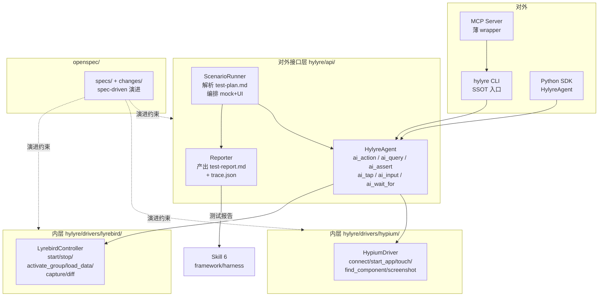

# Hylyre 真机测试框架设计规划

> **状态**：P0 待启动
> **来源**：本规划由 Cursor plan 模式生成，写入工作区供后续追踪。原始 plan 文件副本位于 `~/.cursor/plans/hylyre_framework_design_*.plan.md`。
> **配套进度叙事**：见 [`progress.md`](./progress.md)（待 P0.5 创建）。

## 阶段 todos 总览

- [ ] **P0.1** 环境前置：检测 Python ≥ 3.10、Node ≥ 20.19、npm；不满足则停下给修复指引
- [ ] **P0.2** 工程脚手架：pyproject.toml + hylyre/ 包目录 + CLI typer 占位 + doctor 子命令 + cli help smoke test
- [ ] **P0.3** OpenSpec 初始化：npm 全局装 openspec → openspec init → 校验 openspec/ 与 agent 路由文件
- [ ] **P0.4** 项目宪章 + add-mvp-skeleton change 4 件套（proposal/design/tasks + 5 个 capability spec delta）
- [ ] **P0.5** 进度说明书第一篇 docs/progress.md + README.md 扩写
- [ ] **P0.6** P0 完成校验：pip install -e . / hylyre --help / hylyre doctor / pytest / openspec list 全绿
- [ ] **P1** Hypium 内层：HypiumDriver 实现 connect/start_app/touch/input/screenshot，冻结 UiDriverBase ABC
- [ ] **P2** Lyrebird 内层：LyrebirdController 实现 lifecycle + group activate + 数据加载 + 抓包（含证书自举）
- [ ] **P3** 外层 HylyreAgent：Midscene 风格 ai_action / ai_query / ai_assert / ai_tap / ai_input（VLM endpoint 走环境变量）
- [ ] **P4** ScenarioRunner + Reporter：解析 test-plan.md → 串联 UI+mock → 产 test-report.md + trace.json，先用本仓 fixtures 走通 schema 闭环
- [ ] **P5** 薄 MCP wrapper：FastMCP 封 5-8 原子 tool，与 CLI 共享业务实现
- [ ] **P6** 反哺 Skill 6（遗留待评审）：选 SimulatedWalletForHmos 真实 feature 做端到端回归 + 给 framework/ 提 PR

---

## 0. 关键决策（已确认）

- **实现语言**：Python 3.10+ 主体。Hypium / Lyrebird 都只有 Python SDK；TS 主体需 subprocess 包 Python，IPC 不稳且复杂度 ~1.5x。Skill 6 的 `framework/harness`（TS）只需 shell 调 Hylyre CLI，零侵入。
- **对外形态**：CLI 优先 + 薄 MCP wrapper（双轨）。2026 业界共识——CLI 单命令 ~200 tokens，MCP 多 server 加载 30k–55k tokens；Skill 6 是 6 阶段长链任务上下文极敏感，主路径走 CLI；MCP 作为 host 兼容层（Cursor / Claude Desktop）按需启用。同时为 Code Mode 留口子（直接 import SDK）。
- **对外 API 风格**：Midscene 同名动词 Python 化—`agent.ai_action / ai_query / ai_assert / ai_tap / ai_input / ai_wait_for / ai_locate`。
- **SDD 框架**：OpenSpec（`@fission-ai/openspec`），36k+ stars、specs 落盘 `openspec/`、原生支持 25+ AI agent，正是用户要求的「持久化进度说明书」。**P0 阶段必须跑完 `openspec init`**（包含 Node 20.19+ 环境检测；不满足则在 doctor 中给出清晰修复指引并阻断 P0 完成）。
- **Skill 6 集成**：Hylyre 作为执行器（与 framework 解耦）。`hylyre run --plan ... --feature ...` 产出符合 [testing-rules.yaml](https://raw.githubusercontent.com/sqsqsq/SimulatedWalletForHmos/main/framework/specs/phase-rules/testing-rules.yaml) 的 `test-report.md` 与符合 [trace.schema.json](https://raw.githubusercontent.com/sqsqsq/SimulatedWalletForHmos/main/framework/harness/trace/trace.schema.json) 的 `trace.json`。
- **VLM 厂商 / endpoint**：P3 阶段再定，先用环境变量 `HYLYRE_VLM_ENDPOINT` / `HYLYRE_VLM_API_KEY` / `HYLYRE_VLM_MODEL` 占位，不绑厂商。
- **P4 端到端验证 feature**：遗留问题。P0–P3 全部完成后，依据彼时 SimulatedWalletForHmos 的 `doc/features/` 实际状态再选；先用本仓 `tests/e2e/fixtures/` 下的 mock test-plan.md 跑 schema 闭环。

---

## 1. 总体架构



**两层职责严格隔离**：

- 外层 `hylyre/api/`：只能依赖内层抽象接口（`UiDriverBase` / `MockControllerBase` ABC），**不能** import 任何 hypium / lyrebird 三方包；便于未来替换底层（如 hmdriver2）。
- 内层 `hylyre/drivers/`：每个 driver 独立 package，内部 import 三方依赖，对外只暴露稳定 ABC。

---

## 2. 仓库目录骨架

```
Hylyre/
├── README.md                          # 已存在，需扩写
├── pyproject.toml                     # 新增：包定义 + CLI entrypoint
├── openspec/                          # openspec init 生成
│   ├── project.md                     # 项目宪章
│   ├── specs/                         # 已稳态能力规约
│   │   ├── api-agent/spec.md
│   │   ├── driver-hypium/spec.md
│   │   ├── driver-lyrebird/spec.md
│   │   ├── cli/spec.md
│   │   └── mcp-wrapper/spec.md
│   └── changes/
│       └── add-mvp-skeleton/
│           ├── proposal.md
│           ├── design.md
│           ├── tasks.md
│           └── specs/                 # 各 spec 的 delta
├── docs/
│   ├── plan.md                        # 本文件
│   └── progress.md                    # 长期进度说明书（叙事，待 P0.5 创建）
├── hylyre/
│   ├── api/                           # 外层（Midscene 风格）
│   │   ├── agent.py
│   │   ├── scenario.py
│   │   ├── reporter.py
│   │   └── types.py
│   ├── drivers/
│   │   ├── base/                      # ABC
│   │   ├── hypium/
│   │   └── lyrebird/
│   ├── cli/
│   │   ├── __main__.py
│   │   └── commands/                  # run / mock / device / report / progress / spec / doctor / mcp / ai
│   ├── mcp/server.py                  # FastMCP 薄 wrapper
│   └── progress/store.py              # docs/progress.md 半自动追加
└── tests/
    ├── unit/
    └── e2e/                           # 真机/模拟器
```

`docs/progress.md` 与 `openspec/changes/` 并存：前者人类叙事时间线（决策、踩坑），后者机器可读规约 delta（面向 AI），互不重复。

---

## 3. 对外接口层（Midscene 风格 Python 化）

### 3.1 SDK 形态

```python
from hylyre import HylyreAgent

agent = HylyreAgent(
    device_sn="ABCD1234",
    bundle_name="com.example.app",
    mock={
        "lyrebird_port": 9090,
        "data_root": "./mock-data",
        "active_group": "checkout-success",
    },
)

await agent.start_app()
await agent.ai_action("点击首页底部 Tab 栏第二个图标，进入'我的'页面")
balance = await agent.ai_query("当前余额数值是多少？", schema=float)
await agent.ai_assert("页面顶部显示用户头像和昵称")
await agent.ai_tap(by_text="充值")
await agent.ai_input(by_id="amount", value="100")
```

核心方法（与 [Midscene API](https://midscenejs.com/api) 对齐）：

- 交互：`ai_action` / `ai_tap` / `ai_input` / `ai_scroll` / `ai_hover`
- 查询：`ai_query` / `ai_string` / `ai_number` / `ai_boolean` / `ai_locate`
- 断言/等待：`ai_assert` / `ai_wait_for`
- Hylyre 扩展（mock 专属）：`mock.activate(group)` / `mock.capture(filter)` / `mock.expect_request(matcher)` / `mock.diff(baseline)`

### 3.2 CLI 形态（SSOT）

```bash
# 真机测试主流程：吃 test-plan.md，吐 test-report.md + trace.json
hylyre run \
  --feature wallet-recharge \
  --plan doc/features/wallet-recharge/test-plan.md \
  --device-sn ABCD1234 \
  --bundle com.example.wallet \
  --mock-data doc/features/wallet-recharge/mock-data \
  --report-out doc/features/wallet-recharge/test-report.md \
  --trace-out framework/harness/reports/wallet-recharge/testing/trace.json

# 设备 / Mock 单独操作
hylyre device list
hylyre device install --hap path/to/app.hap
hylyre mock start --port 9090 --data ./mock-data
hylyre mock activate checkout-success
hylyre mock capture --output ./captured.har

# 单步 AI 命令（调试 / AI 协作）
hylyre ai action "点击充值按钮" --device-sn ABCD1234
hylyre ai query "当前余额" --schema number
hylyre ai assert "弹出充值成功 Toast"

# 进度 / OpenSpec 联动
hylyre progress show
hylyre spec list
```

### 3.3 MCP wrapper（按需启动）

```bash
hylyre mcp serve --transport stdio
```

**严格只暴露 5–8 个高频原子工具**（`hylyre_run_plan` / `hylyre_ai_action` / `hylyre_ai_query` / `hylyre_ai_assert` / `hylyre_mock_activate` / `hylyre_device_list` / `hylyre_progress_show`），刻意不导出 SDK 全部 30+ 方法，控制 schema 注入开销 < 5k tokens。CI 加 token 计数 lint。

---

## 4. OpenSpec 集成与持久化进度

### 4.1 引入

```bash
npm install -g @fission-ai/openspec@latest
cd Hylyre
openspec init
```

会写入 `openspec/project.md` + agent 路由文件，并把 `/opsx:propose`、`/opsx:apply`、`/opsx:archive` 注册到所选 agent。

### 4.2 第一个 change `add-mvp-skeleton`

OpenSpec 规范每个变更含 4 个产物：

- `proposal.md` — 为什么、做什么
- `design.md` — 技术决策
- `tasks.md` — 实施 checklist（OpenSpec 自动维护勾选状态）
- `specs/<capability>/spec.md` — 各 spec 的 delta（带 `+`/`-` 前缀的 Requirement / Scenario）

完成 + 验证后用 `/opsx:archive` 归档，spec 自动 merge 到 `openspec/specs/`。

### 4.3 进度说明书

- **机器可读**：`openspec/changes/<id>/tasks.md` + 归档 `openspec/changes/archive/YYYY-MM-DD-<id>/`
- **人类可读**：`docs/progress.md` 由 `hylyre progress` 命令半自动追加：

```markdown
## 2026-05-09 · MVP 骨架
- 决策：Python 3.10、CLI 优先、薄 MCP
- 完成：openspec init / pyproject / 5 个 spec 占位
- 阻塞：mitmproxy 证书在 HarmonyOS 设备上信任流程待自动化
- 下一步：实现 HypiumDriver.connect → start_app
```

---

## 5. Skill 6 真机测试集成合约

Hylyre 的「正确性」由能否端到端通过 Skill 6 现有 `framework/harness/scripts/check-testing.ts` 与 verifier 子 agent 度量。

### 5.1 输入合约

读 `doc/features/<feature>/test-plan.md` 第三章「测试用例清单」表格（列：用例编号 / 用例名称 / 前置条件 / 测试步骤 / 预期结果 / 优先级 / 关联 AC），按行解析为 `TestCase` 对象。**不创造列**，只消费 Skill 6 已固化 schema。

### 5.2 输出合约

- **test-report.md** 必须含 `测试概览 / 测试执行结果（表格，状态 ∈ {通过,失败,阻塞,跳过}）/ 缺陷清单 / 通过率统计（P0/P1/P2 各通过率 + 总体）/ 结论（达标 | 有条件达标 | 不达标）`
- **trace.json** 严格符合 trace.schema.json：`phase = "testing"`、`outcome ∈ {success, partial, failed, aborted}`、`tool_calls` / `retries` / `harness_checks` / `artifacts` 由 Hylyre 运行时自动记录、`model_backend` 由 host 注入（CLI 接受 `--model-backend`）

### 5.3 调用方式

```bash
# Skill 6 Step 5（替换原手工真机操作）— 由主 agent 通过 Shell 工具调
cd <project-root>
hylyre run \
  --feature ${MODULE_NAME} \
  --plan doc/features/${MODULE_NAME}/test-plan.md \
  --device-sn $(hylyre device list --first) \
  --bundle ${BUNDLE_NAME} \
  --report-out doc/features/${MODULE_NAME}/test-report.md \
  --trace-out framework/harness/reports/${MODULE_NAME}/testing/trace.json

# Skill 6 Step 7.1 沿用 framework 自带 harness 验证
cd framework/harness && npx ts-node harness-runner.ts \
  --phase testing --feature ${MODULE_NAME} --summary --failures-only
```

零侵入：framework/ submodule 完全不动，trace.json 路径与 schema 完全对齐。

---

## 6. 分阶段路线图

- **P0 · 骨架（含 openspec init，硬性）** — pyproject.toml、`hylyre` 包导入可用、**`openspec init` 跑完且 `openspec/` 目录与 agent 路由文件全部生成**、`hylyre --help` 输出、`hylyre doctor` 子命令检查 Python/Node/hdc/mitmproxy 环境 → change `add-mvp-skeleton`
- **P1 · Hypium 内层** — HypiumDriver 实现 connect/start_app/touch/input/screenshot；UiDriverBase ABC 冻结；`hylyre device list/install`、`hylyre ai tap/input` 真机跑通 → change `add-driver-hypium`
- **P2 · Lyrebird 内层** — LyrebirdController：lifecycle + group activate + 数据加载 + 抓包；`hylyre mock start/activate/capture` 可用 → change `add-driver-lyrebird`（含子项 `add-cert-bootstrap`）
- **P3 · 外层 Agent + AI 动词** — `ai_action / ai_query / ai_assert`（含 VLM，参考 Midscene 纯视觉路线；endpoint 走 `HYLYRE_VLM_*` 环境变量，不绑厂商）→ change `add-api-agent`
- **P4 · ScenarioRunner + Reporter** — 解析 test-plan.md → 串联 UI + mock → 出 test-report.md + trace.json；先用本仓 `tests/e2e/fixtures/mock-test-plan.md` 跑通 schema 闭环（不依赖外部钱包工程），保证 framework `check-testing.ts` 模拟运行通过 → change `add-scenario-runner`
- **P5 · MCP wrapper** — FastMCP 封 5–8 原子 tool；与 CLI 共享业务实现 → change `add-mcp-wrapper`
- **P6 · 反哺 Skill 6（遗留待评审）** — 等 P0–P5 完成后回头看：① 选 SimulatedWalletForHmos 中的一个真实 feature 做端到端真机回归；② 给 framework/ 提 PR 让 Skill 6 SKILL.md Step 5 标注「优先用 Hylyre 自动化」（在 framework repo 而非本 repo）

每个阶段退出标准：对应 OpenSpec change 的 `tasks.md` 全勾选 + `/opsx:archive` 完成。

---

## 7. 重要风险与缓解

- **Hypium 在 Windows 上 xdevice 安装繁琐** → pyproject 把 hypium 标 `[optional-deps] device`，CI 跑非真机单测；`hylyre doctor` 子命令检测环境
- **Lyrebird 依赖 mitmproxy 证书；HarmonyOS 设备证书信任非交互** → P2 单独立项 `add-cert-bootstrap`；优先 hdc push + bm install 自动化；不行就 doctor 引导
- **AI 动词需 VLM；本地无模型时退化** → 默认走结构化 API（`ai_tap(by_id=...)`），仅显式传 `instruction=...` 才调 VLM；endpoint 走环境变量、不绑厂商
- **MCP schema 膨胀回到老问题** → 强制 ≤ 8 tool，每个描述 < 500 tokens；CI 加 token 计数 lint
- **OpenSpec 与 Skill 6 framework SDD 双源** → 明确分工：OpenSpec 管「Hylyre 自身」spec；framework 管「使用 Hylyre 的业务工程」spec；互不干涉

---

## 8. 立即可执行的「第一刀」（P0，按下列严格顺序）

> 本节是 P0 的**有序 checklist**，每一步完成才能进入下一步。脚本不会动 git submodule，不会安装系统级依赖（除了 npm 全局装 openspec）。

### 8.1 环境前置（自检 + 阻断）

1. 检测 Python ≥ 3.10、Node ≥ 20.19、npm 可用
2. 任何一项不满足：**停下，给出清晰修复指引**（链接到官方安装页），不继续后面步骤——不允许「半骨架」状态

### 8.2 工程脚手架（5 个文件）

3. `pyproject.toml`：包名 `hylyre`、CLI entrypoint `hylyre = "hylyre.cli.__main__:app"`、依赖分组：
   - `[project.optional-dependencies] device = ["hypium"]`
   - `[project.optional-dependencies] mock = ["lyrebird"]`
   - `[project.optional-dependencies] mcp = ["fastmcp>=2"]`
   - 主依赖：`typer`、`pydantic`、`httpx`、`rich`
4. `hylyre/` 包目录：`__init__.py` + `api/`、`drivers/base/`、`drivers/hypium/`、`drivers/lyrebird/`、`cli/commands/`、`mcp/`、`progress/` 各自 `__init__.py`
5. `hylyre/cli/__main__.py`：typer App，注册 `run / mock / device / report / progress / spec / doctor / mcp / ai` 子命令的占位（每个子命令仅打印 "not implemented in P0"，但 `--help` 必须有内容）
6. `hylyre/cli/commands/doctor.py`：实现完整逻辑（检查 Python/Node/npm/hdc/mitmproxy 是否就绪；这是 P0 唯一需要真实实现的子命令）
7. `tests/unit/test_cli_help.py`：smoke test，`hylyre --help`、各子命令 `--help` 退出码必须为 0

### 8.3 OpenSpec 初始化（硬性）

8. `npm install -g @fission-ai/openspec@latest`
9. `cd <Hylyre 根> && openspec init`，按提示选 agent（默认全选 Cursor + Claude Code + Codex 三家路由）
10. 校验：`openspec/project.md`、`openspec/specs/`、`openspec/changes/` 目录存在；agent 路由文件（`.cursor/rules/openspec.mdc` 等）存在

### 8.4 项目宪章 + 第一个 change

11. 改写 `openspec/project.md`：填项目愿景（双层架构、CLI 优先 + 薄 MCP、面向 Skill 6 的执行器定位、Midscene 风格 API、Hypium + Lyrebird 内层）
12. 创建 `openspec/changes/add-mvp-skeleton/` 4 件套：
    - `proposal.md`：动机 = 给 HarmonyOS 真机测试提供「执行器 + mock」的 AI 友好工具链
    - `design.md`：本计划的浓缩版（语言、形态、双层架构、Skill 6 合约）
    - `tasks.md`：把 8.1–8.7 全部步骤作为勾选项落盘
    - `specs/api-agent/spec.md`、`specs/cli/spec.md`、`specs/driver-hypium/spec.md`、`specs/driver-lyrebird/spec.md`、`specs/mcp-wrapper/spec.md`：各 capability 的初版 Requirement + Scenario（用 OpenSpec 的 `+`/`-` delta 语法）

### 8.5 进度说明书第一篇

13. `docs/progress.md`：写「2026-05-XX · MVP 骨架启动」——决策摘要、完成项、下一步

### 8.6 README 扩写

14. 改写 `README.md`：项目定位、与 Hypium / Lyrebird / Midscene / OpenSpec 的关系、与 Skill 6 的契约、当前阶段（P0）、快速开始（`pip install -e . && hylyre doctor`）

### 8.7 P0 完成校验（必须全绿才能进入 P1）

15. `pip install -e .` 成功
16. `hylyre --help` 输出包含全部 9 个子命令
17. `hylyre doctor` 输出真实环境检测结果（不依赖任何子命令实现）
18. `pytest tests/unit/test_cli_help.py` 全绿
19. `openspec/changes/add-mvp-skeleton/tasks.md` 中 8.1–8.6 全部勾选完成
20. `openspec list`（OpenSpec CLI 自带命令）能列出 `add-mvp-skeleton` change
21. git commit（仅在用户明确授权后执行）
