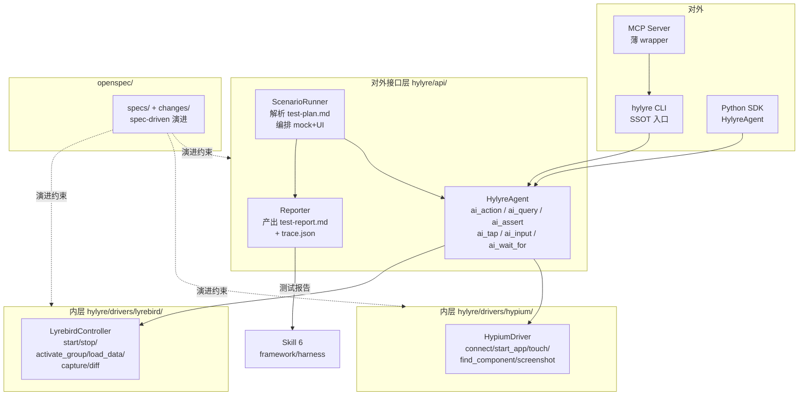

# Hylyre 真机测试框架设计规划

> **状态**：**P4 已交付**（`add-scenario-runner` → `openspec/changes/archive/2026-05-12-add-scenario-runner/`）：`hylyre run` 真机 + `--use-fakes` CI、`report verify`、计划解析与 `trace` `tool_calls`。**下一主目标 P5**（MCP）。**并行债**：`add-cert-bootstrap`；**P2b** mock bootstrap。
> **SSOT**：本文件 `docs/plan.md` 是唯一编辑入口，所有 plan 迭代**只改这里**。
> **UI 镜像**：`~/.cursor/plans/hylyre_framework_design_*.plan.md` 是 Cursor IDE 提供「执行 / 切换模型」按钮所需的同名副本，**只读、由本文件同步**；切换模型或新会话恢复 plan 时点那一份。每次 `docs/plan.md` 改动后，AI 需把全文 + frontmatter 同步到该副本（顶部带「Auto-mirrored」提示）。
> **配套进度叙事**：见 [`progress.md`](./progress.md)。

> **OpenSpec 与 `plan.md`**：阶段级条目以本文件为准；**实施级 tasks**（含烟测、证书子项）在 `openspec/changes/<change-id>/tasks.md`，归档后迁入 `openspec/specs/`。

## 阶段 todos 总览

- [x] **P0.1** 环境前置：检测 Python ≥ 3.10、Node ≥ 20.19、npm；不满足则停下给修复指引
- [x] **P0.2** 工程脚手架：pyproject.toml + hylyre/ 包目录 + CLI typer 占位 + doctor 子命令 + cli help smoke test
- [x] **P0.3** OpenSpec 初始化：npm 全局装 openspec → openspec init → 校验 openspec/ 与 agent 路由文件
- [x] **P0.4** 自测试基础设施：pytest + fakes + L4 自有 schema 占位 + L5 mini-harness 包目录 + framework 兼容性 CI（软提醒）
- [x] **P0.5** 项目宪章 + add-mvp-skeleton change 4 件套（proposal/design/tasks + 5 个 capability spec delta）
- [x] **P0.6** 进度说明书第一篇 docs/progress.md + README.md 扩写
- [x] **P0.7** P0 完成校验：pip install -e . / hylyre --help / hylyre doctor / pytest / openspec list 全绿
- [x] **P1** Hypium 内层：HypiumDriver 实现 connect/start_app/touch/input/screenshot，冻结 UiDriverBase ABC（+ L1 单测 + L2 FakeUiDriver 契约测试 + L3 集成测试覆盖率 ≥ 70%）；OpenSpec `add-driver-hypium` 已归档
- [x] **P2** Lyrebird 内层：`LyrebirdController` + `hylyre mock *` + `FakeMockController` + respx/L1–L3；**设备 MITM 证书自动化**拆至 OpenSpec **`add-cert-bootstrap`**（与 §7 风险项一致）。细粒度勾选见 `openspec/changes/archive/2026-05-11-add-driver-lyrebird/tasks.md`（已归档）。
- [ ] **P2b** Mock 工具链**自动化安装**：**主路径为 pip**（`pip install 'hylyre[mock]'`，同环境安装或校验 **mitmproxy**）；形态为 **`hylyre bootstrap mock`** 与/或仓库内 **`scripts/bootstrap_mock.*`**；结束后复用 **`doctor` 同源检测**。**Windows**（OpenSSL `LIB`/`INCLUDE`、MSVC）、**Docker**（`overbridge/lyrebird` + `HYLYRE_LYREBIRD_URL`）仅作**失败回退与引导**（输出可复制命令 + README 锚点），不默认静默安装系统级组件。OpenSpec change 待定（如 `add-toolchain-bootstrap-mock`）。
- [x] **P3** 外层 HylyreAgent：`HylyreAgent` + Midscene 风格 `ai_action` / `ai_query` / `ai_assert` / `ai_tap` / `ai_input` / `ai_wait_for` / `ai_locate`（VLM 走 `HYLYRE_VLM_*`；单测 `FakeVlmClient`）；**增量**：`run_planned_action` / `run_planned_tap` / `run_planned_input` + `interpret_query_payload` / `interpret_assert_payload`，供调用方自备模型时对 VLM 同形 JSON 落盘，无需配置 `HYLYRE_VLM_*`。OpenSpec **`add-api-agent`** 已归档至 `openspec/changes/archive/2026-05-11-add-api-agent/`（`openspec/specs/api-agent/spec.md` 已跟进该能力）。
- [x] **P4** ScenarioRunner + Reporter：`hylyre run`（`--use-fakes` / 真机 `run_plan_on_agent`、`--bundle` / Lyrebird `--mock-group`）、JSON 或 NL 测试步骤（NL 需 `HYLYRE_VLM_*`）、`test-report.md`+`trace.json`（`0.2-p4`、`tool_calls`）、`hylyre report verify`、fixture 与 OpenSpec **`add-scenario-runner`** 已归档至 `openspec/changes/archive/2026-05-12-add-scenario-runner/`
- [ ] **P5** 薄 MCP wrapper：FastMCP 封 5-8 原子 tool，与 CLI 共享业务实现（+ tool 描述长度 lint < 500 tokens/个；MCP 与 CLI 行为一致性 contract test）
- [ ] **P6** 反哺 Skill 6（遗留待评审）：选 SimulatedWalletForHmos 真实 feature 做端到端回归 + 给 framework/ 提 PR

> **并行债与主线**：**`add-cert-bootstrap`**（设备 MITM 证书 hdc）**与 P4 并行**推进即可，宜在 **P4 端到端真机 + Lyrebird 代理必现** 前具备首版能力；**P2b**（mock 工具链 `bootstrap`，pip 优先）为**体验增强**，可在 **P4 开发间隙或 P4 之后**做，**不作为 P4 退出条件**。

---

## 0. 关键决策（已确认）

- **实现语言**：Python 3.10+ 主体。Hypium / Lyrebird 都只有 Python SDK；TS 主体需 subprocess 包 Python，IPC 不稳且复杂度 ~1.5x。Skill 6 的 `framework/harness`（TS）只需 shell 调 Hylyre CLI，零侵入。
- **对外形态**：CLI 优先 + 薄 MCP wrapper（双轨）。2026 业界共识——CLI 单命令 ~200 tokens，MCP 多 server 加载 30k–55k tokens；Skill 6 是 6 阶段长链任务上下文极敏感，主路径走 CLI；MCP 作为 host 兼容层（Cursor / Claude Desktop）按需启用。同时为 Code Mode 留口子（直接 import SDK）。
- **对外 API 风格**：Midscene 同名动词 Python 化—`agent.ai_action / ai_query / ai_assert / ai_tap / ai_input / ai_wait_for / ai_locate`。
- **SDD 框架**：OpenSpec（`@fission-ai/openspec`），36k+ stars、specs 落盘 `openspec/`、原生支持 25+ AI agent，正是用户要求的「持久化进度说明书」。**P0 阶段必须跑完 `openspec init`**（包含 Node 20.19+ 环境检测；不满足则在 doctor 中给出清晰修复指引并阻断 P0 完成）。
- **Skill 6 集成**：Hylyre 作为执行器（与 framework 解耦）。`hylyre run --plan ... --feature ...` 产出符合 [testing-rules.yaml](https://raw.githubusercontent.com/sqsqsq/SimulatedWalletForHmos/main/framework/specs/phase-rules/testing-rules.yaml) 的 `test-report.md` 与符合 [trace.schema.json](https://raw.githubusercontent.com/sqsqsq/SimulatedWalletForHmos/main/framework/harness/trace/trace.schema.json) 的 `trace.json`。
- **VLM 厂商 / endpoint**：P3 阶段再定，先用环境变量 `HYLYRE_VLM_ENDPOINT` / `HYLYRE_VLM_API_KEY` / `HYLYRE_VLM_MODEL` 占位，不绑厂商。**可选**：调用方不设上述变量，自行对 `agent.ui.screenshot()` 等做理解与 JSON 规划，用 `run_planned_*` / `interpret_*` 与 Hylyre 对接（CLI `hylyre ai` 仍依赖内置 VLM 路径）。
- **P4 端到端验证 feature**：遗留问题。P0–P3 全部完成后，依据彼时 SimulatedWalletForHmos 的 `doc/features/` 实际状态再选；先用本仓 `tests/e2e/fixtures/` 下的 mock test-plan.md 跑 schema 闭环。
- **自测试为一等公民（新增）**：Hylyre 不依赖任何外部仓做质量门禁。从 P0 起就铺设五层自测试金字塔（L1 单元 / L2 ABC 契约 + fakes / L3 集成测试 + fake sidecar / L4 自有 schema 自校验 / L5 自托管 mini-harness），与每个阶段同步生长，作为对应 OpenSpec change 的硬性退出条件。详见第 7.5 节。
- **输出契约 SSOT 归属（新增）**：Hylyre 输出格式（`test-report.md` 章节、`trace.json` 字段）的 SSOT **在 Hylyre 仓内** `hylyre/contracts/`。L4 自校验跑这套自有 schema。另起一个**软提醒级**的兼容性 CI：拉 framework 仓的 schema 做差异对比，失败时自动在 `docs/progress.md` 添一条「framework schema drift 待评估」，**不阻塞主 CI、不阻塞发布**。Hylyre 与 framework 之间只单向输出，永不反向引用，避免循环依赖。
- **Mock 工具链自动化（新增）**：若提供一键/半自动安装，**默认与优选路径为 pip**（`hylyre[mock]`、mitmproxy）；**不**把 Windows 原生 Lyrebird 的系统前置（OpenSSL/MSVC）或 Docker 作为默认静默安装目标，仅作文档化回退与 `doctor`/bootstrap 失败时的指引。

---

## 1. 总体架构



**两层职责严格隔离**：

- 外层 `hylyre/api/`：只能依赖内层抽象接口（`UiDriverBase` / `MockControllerBase` ABC），**不能** import 任何 hypium / lyrebird 三方包；便于未来替换底层（如 hmdriver2）。
- 内层 `hylyre/drivers/`：每个 driver 独立 package，内部 import 三方依赖，对外只暴露稳定 ABC。

---

## 2. 仓库目录骨架

```
Hylyre/
├── README.md                          # 已存在，需扩写
├── pyproject.toml                     # 新增：包定义 + CLI entrypoint
├── openspec/                          # openspec init 生成
│   ├── project.md                     # 项目宪章
│   ├── specs/                         # 已稳态能力规约
│   │   ├── api-agent/spec.md
│   │   ├── driver-hypium/spec.md
│   │   ├── driver-lyrebird/spec.md
│   │   ├── cli/spec.md
│   │   └── mcp-wrapper/spec.md
│   └── changes/
│       └── add-mvp-skeleton/
│           ├── proposal.md
│           ├── design.md
│           ├── tasks.md
│           └── specs/                 # 各 spec 的 delta
├── docs/
│   ├── plan.md                        # 本文件
│   └── progress.md                    # 长期进度说明书（叙事，待 P0.6 创建）
├── hylyre/
│   ├── api/                           # 外层（Midscene 风格）
│   │   ├── agent.py
│   │   ├── scenario.py
│   │   ├── reporter.py
│   │   └── types.py
│   ├── drivers/
│   │   ├── base/                      # ABC
│   │   ├── hypium/
│   │   └── lyrebird/
│   ├── cli/
│   │   ├── __main__.py
│   │   └── commands/                  # run / mock / device / report / progress / spec / doctor / mcp / ai
│   ├── contracts/                     # 【新增】L4 SSOT：Hylyre 自有输出 schema
│   │   ├── output-schema.json         # test-report.md / trace.json 字段约束（Hylyre 自定义）
│   │   ├── report-sections.yaml       # test-report.md 必需章节与表格列定义
│   │   └── README.md                  # 契约维护规则与与 framework 的关系说明
│   ├── harness/                       # 【新增】L5 自托管 mini-harness
│   │   ├── check_report.py            # 校验 test-report.md（章节、表格、状态值域、AC 追溯）
│   │   ├── check_trace.py             # 校验 trace.json（jsonschema）
│   │   └── runner.py                  # 暴露为 CLI: hylyre report verify
│   ├── mcp/server.py                  # FastMCP 薄 wrapper
│   └── progress/store.py              # docs/progress.md 半自动追加
├── tests/
│   ├── unit/                          # L1：每个模块单测
│   ├── contract/                      # L2：ABC 契约测试 + fakes
│   │   ├── fakes/                     # FakeUiDriver / FakeMockController / FakeVlmClient
│   │   └── ...
│   ├── integration/                   # L3：集成测试（fake sidecar，无真机/真 lyrebird）
│   ├── schema/                        # L4：jsonschema 自校验（用 hylyre/contracts/）
│   ├── compat/                        # 软提醒：与 framework schema 兼容性照镜
│   └── e2e/                           # 真机/模拟器（CI 默认跳过，需打 marker）
└── .github/workflows/
    ├── ci.yml                         # L1+L2+L3+L4 必跑
    └── compat-framework.yml           # 软提醒：拉 framework schema 比对，失败仅 warning + progress.md 追加
```

`docs/progress.md` 与 `openspec/changes/` 并存：前者人类叙事时间线（决策、踩坑），后者机器可读规约 delta（面向 AI），互不重复。

---

## 3. 对外接口层（Midscene 风格 Python 化）

### 3.1 SDK 形态

```python
from hylyre import HylyreAgent

agent = HylyreAgent(
    device_sn="ABCD1234",
    bundle_name="com.example.app",
    mock={
        "lyrebird_port": 9090,
        "data_root": "./mock-data",
        "active_group": "checkout-success",
    },
)

await agent.start_app()
await agent.ai_action("点击首页底部 Tab 栏第二个图标，进入'我的'页面")
balance = await agent.ai_query("当前余额数值是多少？", schema=float)
await agent.ai_assert("页面顶部显示用户头像和昵称")
await agent.ai_tap(by_text="充值")
await agent.ai_input(by_id="amount", value="100")
```

核心方法（与 [Midscene API](https://midscenejs.com/api) 对齐）：

- 交互：`ai_action` / `ai_tap` / `ai_input` / `ai_scroll` / `ai_hover`
- 查询：`ai_query` / `ai_string` / `ai_number` / `ai_boolean` / `ai_locate`
- 断言/等待：`ai_assert` / `ai_wait_for`
- Hylyre 扩展（mock 专属）：`mock.activate(group)` / `mock.capture(filter)` / `mock.expect_request(matcher)` / `mock.diff(baseline)`

### 3.2 CLI 形态（SSOT）

```bash
# 真机测试主流程：吃 test-plan.md，吐 test-report.md + trace.json
hylyre run \
  --feature wallet-recharge \
  --plan doc/features/wallet-recharge/test-plan.md \
  --device-sn ABCD1234 \
  --bundle com.example.wallet \
  --mock-data doc/features/wallet-recharge/mock-data \
  --report-out doc/features/wallet-recharge/test-report.md \
  --trace-out framework/harness/reports/wallet-recharge/testing/trace.json

# 设备 / Mock 单独操作
hylyre device list
hylyre device install --hap path/to/app.hap
hylyre mock start --port 9090 --data ./mock-data
hylyre mock activate checkout-success
hylyre mock capture --output ./captured.har

# 单步 AI 命令（调试 / AI 协作）
hylyre ai action "点击充值按钮" --device-sn ABCD1234
hylyre ai query "当前余额" --schema number
hylyre ai assert "弹出充值成功 Toast"

# 进度 / OpenSpec 联动
hylyre progress show
hylyre spec list

# 自校验门禁（L5 mini-harness）— 既给 hylyre run 内置调用，也可独立使用
hylyre report verify \
  --report doc/features/wallet-recharge/test-report.md \
  --trace framework/harness/reports/wallet-recharge/testing/trace.json \
  --plan doc/features/wallet-recharge/test-plan.md
```

### 3.3 MCP wrapper（按需启动）

```bash
hylyre mcp serve --transport stdio
```

**严格只暴露 5–8 个高频原子工具**（`hylyre_run_plan` / `hylyre_ai_action` / `hylyre_ai_query` / `hylyre_ai_assert` / `hylyre_mock_activate` / `hylyre_device_list` / `hylyre_progress_show`），刻意不导出 SDK 全部 30+ 方法，控制 schema 注入开销 < 5k tokens。CI 加 token 计数 lint。

---

## 4. OpenSpec 集成与持久化进度

### 4.1 引入

```bash
npm install -g @fission-ai/openspec@latest
cd Hylyre
openspec init
```

会写入 `openspec/project.md` + agent 路由文件，并把 `/opsx:propose`、`/opsx:apply`、`/opsx:archive` 注册到所选 agent。

### 4.2 第一个 change `add-mvp-skeleton`

OpenSpec 规范每个变更含 4 个产物：

- `proposal.md` — 为什么、做什么
- `design.md` — 技术决策
- `tasks.md` — 实施 checklist（OpenSpec 自动维护勾选状态）
- `specs/<capability>/spec.md` — 各 spec 的 delta（带 `+`/`-` 前缀的 Requirement / Scenario）

完成 + 验证后用 `/opsx:archive` 归档，spec 自动 merge 到 `openspec/specs/`。

### 4.3 进度说明书

- **机器可读**：`openspec/changes/<id>/tasks.md` + 归档 `openspec/changes/archive/YYYY-MM-DD-<id>/`
- **人类可读**：`docs/progress.md` 由 `hylyre progress` 命令半自动追加：

```markdown
## 2026-05-09 · MVP 骨架
- 决策：Python 3.10、CLI 优先、薄 MCP
- 完成：openspec init / pyproject / 5 个 spec 占位
- 阻塞：mitmproxy 证书在 HarmonyOS 设备上信任流程待自动化
- 下一步：实现 HypiumDriver.connect → start_app
```

---

## 5. Skill 6 真机测试集成合约（单向输出，不反向依赖）

Hylyre 的「正确性」由 **Hylyre 自有的 L4+L5 自测试** 保证（详见 7.5 节），**不依赖** framework 仓 / Skill 6 在线可用。framework 是 Hylyre 输出的下游消费者，双方约定通过「契约镜像比对」保持兼容（软提醒级 CI）。

### 5.1 输入合约（参考性约束）

读 `doc/features/<feature>/test-plan.md` 第三章「测试用例清单」表格（列：用例编号 / 用例名称 / 前置条件 / 测试步骤 / 预期结果 / 优先级 / 关联 AC），按行解析为 `TestCase` 对象。表格 schema 由 `hylyre/contracts/report-sections.yaml` **在 Hylyre 仓内独立声明**；初始版本与 Skill 6 模板一致，后续以本仓为 SSOT。

### 5.2 输出合约（Hylyre 仓 SSOT）

输出格式由 `hylyre/contracts/output-schema.json` 与 `hylyre/contracts/report-sections.yaml` 定义：

- **test-report.md** 必须含 `测试概览 / 测试执行结果（表格，状态 ∈ {通过,失败,阻塞,跳过}）/ 缺陷清单 / 通过率统计（P0/P1/P2 各通过率 + 总体）/ 结论（达标 | 有条件达标 | 不达标）`
- **trace.json** 必须满足：`phase = "testing"`、`outcome ∈ {success, partial, failed, aborted}`、`tool_calls` / `retries` / `artifacts` 由 Hylyre 运行时自动记录、`model_backend` 由 host 注入（CLI 接受 `--model-backend`）

framework 仓的 `trace.schema.json` 与 `testing-rules.yaml` 当前是兼容的事实标准，但 **不是 Hylyre 的 SSOT**。CI `compat-framework.yml` 拉 framework schema 做一次差异断言，发现漂移**只**在 `docs/progress.md` 自动追加一条「framework schema drift 待评估」，**不阻塞主 CI / 不阻塞发布**——是否调整 Hylyre SSOT 由人评估后决定。

### 5.3 调用方式

```bash
# Skill 6 Step 5（替换原手工真机操作）— 由主 agent 通过 Shell 工具调
cd <project-root>
hylyre run \
  --feature ${MODULE_NAME} \
  --plan doc/features/${MODULE_NAME}/test-plan.md \
  --device-sn $(hylyre device list --first) \
  --bundle ${BUNDLE_NAME} \
  --report-out doc/features/${MODULE_NAME}/test-report.md \
  --trace-out framework/harness/reports/${MODULE_NAME}/testing/trace.json

# Skill 6 Step 7.1 沿用 framework 自带 harness 验证
cd framework/harness && npx ts-node harness-runner.ts \
  --phase testing --feature ${MODULE_NAME} --summary --failures-only
```

零侵入：framework/ submodule 完全不动，trace.json 路径与 schema 完全对齐。

---

## 6. 分阶段路线图

每个阶段退出标准：对应 OpenSpec change 的 `tasks.md` 全勾选 + `/opsx:archive` 完成 + **本阶段对应的自测试层（见 7.5）全部纳入并通过**。

- **P0 · 骨架（含 openspec init + 自测试基础设施，硬性）** — pyproject.toml、`hylyre` 包导入可用、**`openspec init` 跑完且 `openspec/` 目录与 agent 路由文件全部生成**、`hylyre --help` 输出、`hylyre doctor` 子命令检查 Python/Node/hdc/mitmproxy 环境、**pytest 跑通空骨架 + L4 schema 占位文件就位 + L5 mini-harness 包目录创建 + `compat-framework.yml` workflow 文件就绪** → change `add-mvp-skeleton`
- **P1 · Hypium 内层** — HypiumDriver 实现 connect/start_app/touch/input/screenshot；UiDriverBase ABC 冻结；`hylyre device list/install`、`hylyre ai tap/input` 真机跑通 — **配套**：L1 driver 单测 + L2 `FakeUiDriver` 契约测试 + L3 集成测试覆盖率 ≥ 70% → change `add-driver-hypium`
- **P2 · Lyrebird 内层** — LyrebirdController：lifecycle + group activate + 数据加载 + 抓包；`hylyre mock start/activate/capture` 可用 — **配套**：L1 单测 + L2 `FakeMockController` 契约测试 + L3 用 [`respx`](https://github.com/lundberg/respx) 拦截 HTTP，CI 不真起 lyrebird 进程 → change `add-driver-lyrebird`（含子项 `add-cert-bootstrap`）
- **P2b · Mock 工具链自动化（pip 优先）** — `hylyre bootstrap mock` 与/或 `scripts/bootstrap_mock.*`：默认 **`pip install 'hylyre[mock]'`** + mitmproxy 安装/校验；成功后与 **`doctor` 共享检测逻辑**；Windows OpenSSL/MSVC、Docker 仅文档与失败回退（不默认静默系统安装）→ change 待定（如 `add-toolchain-bootstrap-mock`）
- **P3 · 外层 Agent + AI 动词** — `HylyreAgent` + `ai_action / ai_query / ai_assert / …`（VLM 经 `HYLYRE_VLM_*`；`HttpVlmClient` + `FakeVlmClient`）+ `run_planned_*` / `interpret_*`（外部规划器、无 VLM）— **配套**：L1 单测，CI 不依赖真实模型 → change `add-api-agent`（**已归档** `archive/2026-05-11-add-api-agent`）；规约见 `openspec/specs/api-agent/spec.md`
- **P4 · ScenarioRunner + Reporter + L5 mini-harness 上线** — 解析 test-plan.md → 串联 UI + mock → 出 test-report.md + trace.json；**L4 自有 schema 全量校验**；**L5 `hylyre report verify` 实现**并作为 `hylyre run` 的内置最后一步（自我门禁）；本仓 `tests/e2e/fixtures/mock-test-plan.md` 端到端跑通完整闭环，**完全不需要 framework 仓在线** → change `add-scenario-runner`
- **P5 · MCP wrapper** — FastMCP 封 5–8 原子 tool；与 CLI 共享业务实现 — **配套**：tool 描述长度 lint < 500 tokens / 个；MCP 与 CLI 行为一致性 contract test（同一动作两条路径产物等价） → change `add-mcp-wrapper`
- **P6 · 反哺 Skill 6（遗留待评审）** — 等 P0–P5 完成后回头看：① 选 SimulatedWalletForHmos 中的一个真实 feature 做端到端真机回归；② 给 framework/ 提 PR 让 Skill 6 SKILL.md Step 5 标注「优先用 Hylyre 自动化」（在 framework repo 而非本 repo）

---

## 7. 重要风险与缓解

- **Hypium 在 Windows 上 xdevice 安装繁琐** → pyproject 把 hypium 标 `[optional-deps] device`，CI 跑非真机单测；`hylyre doctor` 子命令检测环境
- **Lyrebird 依赖 mitmproxy 证书；HarmonyOS 设备证书信任非交互** → P2 单独立项 `add-cert-bootstrap`；优先 hdc push + bm install 自动化；不行就 doctor 引导
- **Mock 工具链步骤多、易装失败**（新增） → **P2b**：自动化安装命令 **优选 pip**（`hylyre[mock]` + mitmproxy）；bootstrap 后 **`doctor` 复检**；Windows（`LIB`/`INCLUDE`、MSVC）、Docker 仅 **README + Lyrebird 官方说明** 中的回退路径，不默认静默装系统依赖
- **AI 动词需 VLM；本地无模型时退化** → 默认走结构化 API（`ai_tap(by_id=...)`），仅显式传 `instruction=...` 才调 VLM；endpoint 走环境变量、不绑厂商
- **MCP schema 膨胀回到老问题** → 强制 ≤ 8 tool，每个描述 < 500 tokens；CI 加 token 计数 lint
- **OpenSpec 与 Skill 6 framework SDD 双源** → 明确分工：OpenSpec 管「Hylyre 自身」spec；framework 管「使用 Hylyre 的业务工程」spec；互不干涉
- **framework 仓 schema 漂移导致 Skill 6 接不上**（新增） → `compat-framework.yml` 软提醒 CI 持续监测；漂移时自动写 `docs/progress.md`，由人决定是否调整 Hylyre SSOT；**绝不**让 framework 漂移阻塞 Hylyre 主线交付

---

## 7.5 自测试金字塔（五层，与 P0–P5 同步生长）

> **核心原则**：Hylyre 的质量门禁完全自治，离线 CI 也能通过；framework 是消费方，不是依赖方。

| 层 | 名称 | 范围 | 工具 | 起步阶段 | CI 行为 |
|---|---|---|---|---|---|
| L1 | 单元测试 | 每个模块函数 | `pytest`、`pytest-cov` | P0 起空骨架，P1+ 实质 | 必跑、阻塞 |
| L2 | ABC 契约测试 | `UiDriverBase` / `MockControllerBase` / `VlmClientBase` 配 fakes | `pytest` + `tests/contract/fakes/` | P1 起 | 必跑、阻塞 |
| L3 | 集成测试（fake sidecar） | 外层串内层，但内层用 fake；HTTP 用 `respx` 拦截 | `pytest` + `respx` + 内置 fakes | P1 起 | 必跑、阻塞 |
| L4 | 自有 schema 自校验 | `hylyre/contracts/output-schema.json` + `report-sections.yaml` 校验 Hylyre 自己的输出 | `jsonschema` + 自写 markdown lint | P0 占位、P4 全量 | 必跑、阻塞 |
| L5 | 自托管 mini-harness | 模拟 Skill 6 的 `check-testing.ts` 关键检查（章节、表格、状态值域、AC 追溯、计划-报告一致性） | `hylyre/harness/`（暴露 `hylyre report verify`） | P0 包目录、P4 实质 | 必跑、阻塞；**也作为 `hylyre run` 内置门禁** |
| -- | 兼容性照镜（不算正式层） | 与 framework 仓 schema 比对 | `compat-framework.yml` | P0 workflow 文件就绪、P4 启用 | **软提醒，不阻塞**；失败自动写 progress.md |

**fakes 清单**（`tests/contract/fakes/`）：

- `FakeUiDriver`：实现 `UiDriverBase`，内存里维护页面树与点击事件；用于 P3+ 外层测试不依赖真机
- `FakeMockController`：实现 `MockControllerBase`，内存里维护 mock group / 录制请求；不起进程
- `FakeVlmClient`：录制回放模式；P3 起所有 ai_* 单测都用它，禁止 CI 调真实模型
- `FakeHdcShell`：模拟 hdc 命令输出；用于 doctor / device 子命令测试

**L5 mini-harness 检查项（最小集合，P4 落地）**：

- 报告必需章节：测试概览 / 测试执行结果 / 缺陷清单（如有失败） / 通过率统计 / 结论
- 执行结果表格：状态值 ∈ {通过,失败,阻塞,跳过}
- 通过率统计：含 P0/P1/P2 各通过率 + 总体
- 结论判定：达标 / 有条件达标 / 不达标，且与通过率数据一致
- 计划-报告一致性：报告中所有用例编号必须在计划中存在
- AC 追溯：报告中每条用例必须有非空「关联 AC」字段
- trace.json：通过 `output-schema.json` jsonschema 校验

---

## 8. 立即可执行的「第一刀」（P0，按下列严格顺序）

> 本节是 P0 的**有序 checklist**，每一步完成才能进入下一步。脚本不会动 git submodule，不会安装系统级依赖（除了 npm 全局装 openspec）。

### 8.1 环境前置（自检 + 阻断）

1. 检测 Python ≥ 3.10、Node ≥ 20.19、npm 可用
2. 任何一项不满足：**停下，给出清晰修复指引**（链接到官方安装页），不继续后面步骤——不允许「半骨架」状态

### 8.2 工程脚手架

3. `pyproject.toml`：包名 `hylyre`、CLI entrypoint `hylyre = "hylyre.cli.__main__:app"`、依赖分组：
   - 主依赖：`typer`、`pydantic`、`httpx`、`rich`、`jsonschema`、`pyyaml`
   - `[project.optional-dependencies] device = ["hypium"]`
   - `[project.optional-dependencies] mock = ["lyrebird"]`
   - `[project.optional-dependencies] mcp = ["fastmcp>=2"]`
   - `[project.optional-dependencies] dev = ["pytest", "pytest-cov", "respx"]`
4. `hylyre/` 包目录：`__init__.py` + `api/`、`drivers/base/`、`drivers/hypium/`、`drivers/lyrebird/`、`cli/commands/`、`contracts/`、`harness/`、`mcp/`、`progress/` 各自 `__init__.py`
5. `hylyre/cli/__main__.py`：typer App，注册 `run / mock / device / report / progress / spec / doctor / mcp / ai` 子命令的占位（每个子命令仅打印 "not implemented in P0"，但 `--help` 必须有内容）；`report` 下挂 `verify` 子子命令的占位（P4 实现）
6. `hylyre/cli/commands/doctor.py`：实现完整逻辑（检查 Python/Node/npm/hdc/mitmproxy 是否就绪；这是 P0 唯一需要真实实现的业务子命令）

### 8.3 自测试基础设施（新增，硬性）

7. `tests/` 子目录骨架：`unit/`、`contract/fakes/`、`integration/`、`schema/`、`compat/`、`e2e/`，每个目录建空 `__init__.py` + 一篇 README.md 说明该层的范围与跑法
8. `tests/unit/test_cli_help.py`：L1 smoke test，`hylyre --help` 与各子命令 `--help` 退出码必须为 0
9. `tests/schema/test_contracts_loadable.py`：L4 占位测试，验证 `hylyre/contracts/output-schema.json` 与 `report-sections.yaml` 文件存在且能被 `jsonschema` / `pyyaml` 解析（schema 内容可先放最小骨架，P4 充实）
10. `hylyre/contracts/output-schema.json`：先放最小骨架（trace.json 顶层字段：`schema_version` / `feature` / `phase` / `outcome`），后续 P4 扩
11. `hylyre/contracts/report-sections.yaml`：先放最小骨架（必需章节列表 + 状态值域），P4 扩
12. `hylyre/contracts/README.md`：说明本目录是 SSOT，与 framework 关系、修改流程
13. `hylyre/harness/__init__.py` + `runner.py`：占位，导出 `verify_report(report, trace, plan)` 函数签名（P4 实现）
14. `.github/workflows/ci.yml`：跑 L1+L4 占位测试（P0 阶段 L2/L3/L5 还没东西可跑）
15. `.github/workflows/compat-framework.yml`：占位 workflow，schedule + manual 触发；脚本仅 echo "compat check placeholder"，P4 起跑真实比对

### 8.4 OpenSpec 初始化（硬性）

16. `npm install -g @fission-ai/openspec@latest`
17. `cd <Hylyre 根> && openspec init`，按提示选 agent（默认全选 Cursor + Claude Code + Codex 三家路由）
18. 校验：`openspec/project.md`、`openspec/specs/`、`openspec/changes/` 目录存在；agent 路由文件（`.cursor/rules/openspec.mdc` 等）存在

### 8.5 项目宪章 + 第一个 change

19. 改写 `openspec/project.md`：填项目愿景（双层架构、CLI 优先 + 薄 MCP、面向 Skill 6 的执行器定位、Midscene 风格 API、Hypium + Lyrebird 内层、**自测试五层金字塔为质量底座**）
20. 创建 `openspec/changes/add-mvp-skeleton/` 4 件套：
    - `proposal.md`：动机 = 给 HarmonyOS 真机测试提供「执行器 + mock」的 AI 友好工具链
    - `design.md`：本计划的浓缩版（语言、形态、双层架构、Skill 6 合约、自测试金字塔）
    - `tasks.md`：把 8.1–8.8 全部步骤作为勾选项落盘
    - `specs/api-agent/spec.md`、`specs/cli/spec.md`、`specs/driver-hypium/spec.md`、`specs/driver-lyrebird/spec.md`、`specs/mcp-wrapper/spec.md`、`specs/contracts/spec.md`（**新增**：定义 Hylyre 输出契约 SSOT）：各 capability 的初版 Requirement + Scenario（用 OpenSpec 的 `+`/`-` delta 语法）

### 8.6 进度说明书第一篇

21. `docs/progress.md`：写「2026-05-XX · MVP 骨架启动」——决策摘要（含「自测试自治、不依赖 framework」）、完成项、下一步

### 8.7 README 扩写

22. 改写 `README.md`：项目定位、与 Hypium / Lyrebird / Midscene / OpenSpec 的关系、与 Skill 6 的**单向输出**契约、自测试五层金字塔、当前阶段（P0）、快速开始（`pip install -e ".[dev]" && hylyre doctor && pytest`）

### 8.8 P0 完成校验（必须全绿才能进入 P1）

23. `pip install -e ".[dev]"` 成功
24. `hylyre --help` 输出包含全部 9 个子命令；`hylyre report verify --help` 也有内容（占位）
25. `hylyre doctor` 输出真实环境检测结果
26. `pytest` 全绿（覆盖 `tests/unit/test_cli_help.py` + `tests/schema/test_contracts_loadable.py`）
27. `openspec/changes/add-mvp-skeleton/tasks.md` 中 8.1–8.7 全部勾选完成
28. `openspec list`（OpenSpec CLI 自带命令）能列出 `add-mvp-skeleton` change
29. `.github/workflows/ci.yml` 与 `compat-framework.yml` 文件就绪（不需要 push 触发，只验证文件存在）
30. git commit（仅在用户明确授权后执行）
